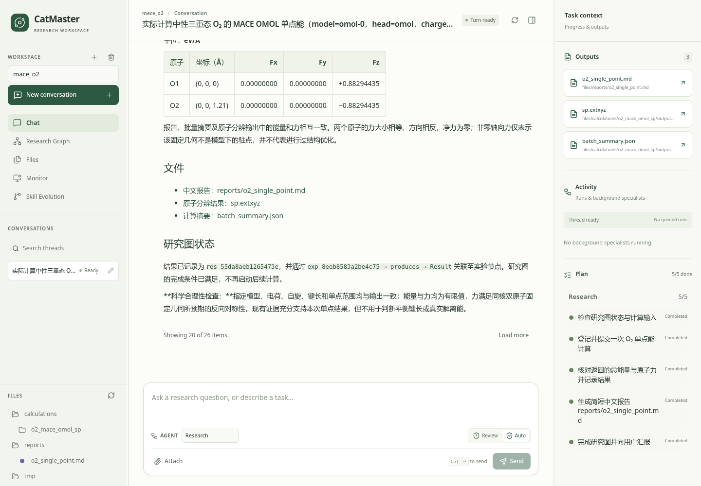
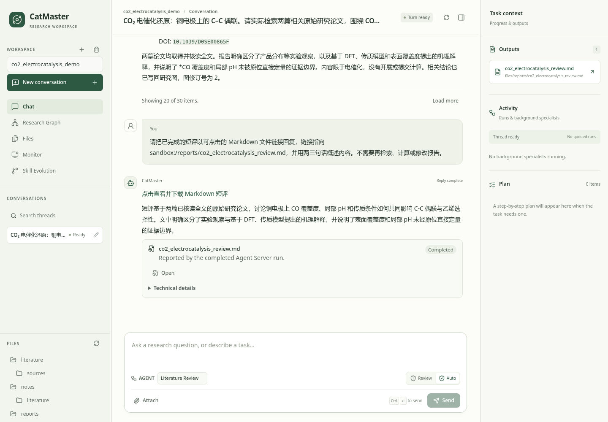
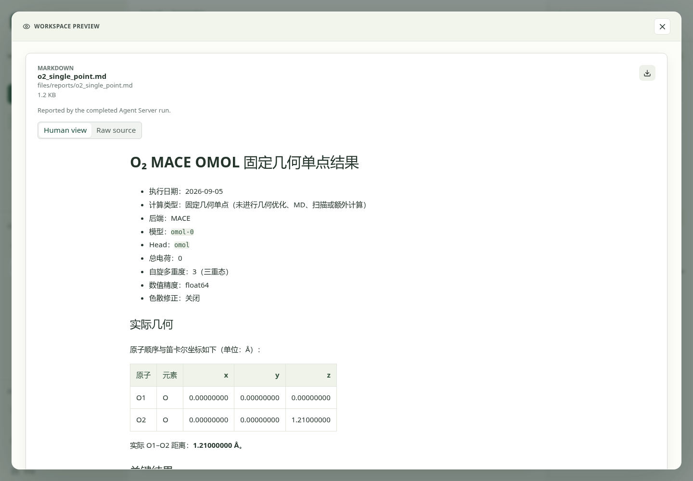
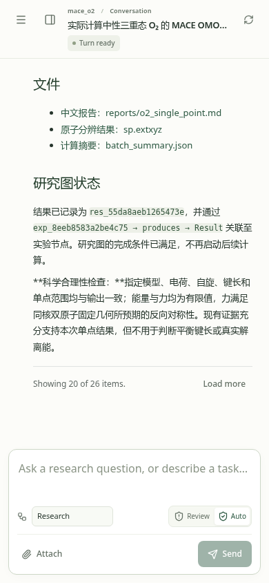
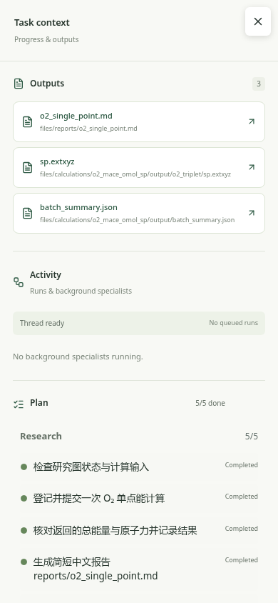

# CatMaster

[中文](#从研究目标出发) | [English](#start-from-a-research-objective)

CatMaster 是一个面向计算催化、材料建模、文献研究和科研写作的自主 Agent 工作台。它把对话、项目文件、领域 skills、可执行 tools、人工审批和受管远程计算放在同一个 workspace 中。用户可以从研究目标出发，不必先把工作拆成一串工具调用。

CatMaster is an autonomous agent workbench for computational catalysis, materials modeling, literature research, and scientific writing. It brings conversations, project files, domain skills, executable tools, approvals, and managed remote computation into one workspace. Users can begin with a research objective instead of scripting a sequence of tool calls.

## 界面预览 / UI preview

以下截图来自两个独立展示示例：MACE O₂ 单点计算，以及铜电极 CO₂ 电催化还原文献调研。左侧管理项目、会话和文件，中间显示对话，右侧 Task Context 显示产出、运行状态和计划。点击 Outputs 中的报告即可预览内容。

These screenshots come from two standalone demos: a MACE O₂ single-point calculation and a literature review of CO₂ electroreduction on copper. Projects, conversations, and files sit on the left; the conversation is in the center. Task Context on the right shows outputs, activity, and the plan. Reports open directly from Outputs.



<details>
<summary>更多截图：电催化文献调研、报告预览、手机界面 / More screenshots: electrocatalysis review, report preview, and mobile</summary>

### 电催化文献调研 / Electrocatalysis literature review

这个示例核读两篇公开原始论文，讨论铜电极 CO₂/CO 电还原中的 CO 覆盖度、局部环境与乙烯选择性，并将短评保存为可打开的项目报告。

This example reads two published research papers on CO₂/CO electroreduction on copper, examining CO coverage, the local reaction environment, and ethylene selectivity. The short review is saved as a report that opens from the conversation.



### 报告预览 / Report preview

报告在当前页面打开，可以阅读格式化内容、查看原文或下载文件。

Reports open on the same page, with formatted content, raw source, and a download option.



### 手机界面 / Mobile

窄屏保留对话和输入框，导航与 Task Context 收进侧边抽屉。

On narrow screens, the conversation and composer stay visible; navigation and Task Context open in side drawers.

<p>
  
  
</p>

</details>

使用说明：[WebUI 中文指南](docs/user-guide/04-webui.zh.md) · [WebUI guide in English](docs/user-guide/04-webui.en.md)。

## 从研究目标出发

CatMaster 可以直接从研究目标安排工作。Agent 会根据现有文件、科学约束和当前部署能力选择 skill，调用 tool，并检查中间产物。用户仍然决定会改变科学含义、花费远程算力或影响重要文件的事项。

WebUI 提供五个研究入口：

| Agent | 主要角色 | 能力来源举例 | 适合交付 |
|---|---|---|---|
| Research | 拆解开放研究目标并下发实际执行 | 可委派 Literature Review、Experiment、Writing、Peer Review，并读取项目文件、记忆与返回产物 | 已执行的文献、计算、写作和审稿阶段，证据地图与跨阶段结论 |
| Experiment | 组织有边界的建模、计算和验证 | Materials、Dynamics、ML、ORCA/xTB workers，以及结构、计算、轨迹和远程执行 skills | 结构候选、计算 stage、数据集、轨迹分析和结果合同 |
| Literature Review | 从论文发现走到可追溯证据 | 网页检索、受控浏览、本地语料、全文精读和引用核验 tools 与 skills | 检索记录、证据表、双语精读、引用库和综述 |
| Writing | 把已有证据组织成科研交付物 | 论文写作、润色、引用、数据声明、图件、PPT、投稿回复和专利 skills | Markdown、LaTeX、DOCX、PPTX、图件和 PDF |
| Peer Review | 独立审查一份固定稿件 | 多 reviewer 模型、审稿 worker 和 `peer_review_request` | 原始 reviewer reports、editor synthesis 和修订问题单 |

Research 负责方向判断，并把有边界的阶段交给能够执行的 specialist。在用户授权范围内，一项研究可以从文献证据缺口推进到结构建模、远程计算、结果复核、写作和独立审稿。具体操作由拥有相应 tools 与 skills 的 specialist 或 worker 完成。结果返回 workspace 后，Research 会核对证据，再决定补充验证还是收束结论。

需要跨 thread 延续、比较竞争解释或让一个结果影响多个假设时，可以绑定 workspace 级 Research Graph。图中保存 Hypothesis、Experiment、Result、证据来源、条件性判断和修订关系；论文、结构和报告保留在原有文件中。普通 Research 与 Persistent Research 使用同一个 ResearchSpecialist，后者在用户授权的阶段内继续推进。拟因科研困境停止时，由独立 proposer 检查是否遗漏了有价值的下一步；有用的授权行动默认验证一次。达到用户请求、用户暂停或需要新的计算授权时可以停止。科学选择由 agent 根据图谱与证据完成，后台只恢复已接受的工作和传递结果。

长期工作在独立的 DeepAgents/LangGraph 线程中执行，DBOS 使用本地 SQL 队列管理后台并发、取消和进程恢复。后台任务运行时可以继续前台对话；任务可选择完成后继续主对话或仅更新状态。Steer、Queue、Replace 和 Reject 保留各自语义。Activity 展示进展、reasoning 和工具，浏览器断线不取消执行。

Persistent Research 的主线程负责持续协调。后台任务按完成策略将结果送入该线程，科学记录沿用既有 Research Graph。主线程一轮结束或浏览器断线不等于研究完成；用户停止、暂停和本阶段完成条件限制后续自动执行。并行分支应使用各自的输出路径，需要修改同一文件时由一个执行者负责。

Experiment 下的四类 worker 进一步分工：Materials 负责晶体、表面、吸附、缺陷、反应路径和性质计算；Dynamics 负责 AIMD、LAMMPS、MLFF MD、restart 与轨迹；ML 负责数据集、MACE 训练评估和主动学习；ORCA/xTB 负责分子、构象、xTB、CREST、ORCA、TS、IRC、TDDFT 与 NMR。

完整说明和可直接改写的参考 prompt 见[中文用户手册](docs/user-guide/README.zh.md)。手册先解释 Agent 能完成的研究工作，再在可展开区域列出当前 tools 与 skills；远程 task 独立成章，不与结构准备混为一谈。

## 快速启动

本地使用 `start_webui.sh` 启动 WebUI 和同进程执行宿主。DBOS 控制库位于项目根目录的 `.catmaster/execution.sqlite`，每个 workspace 的 checkpoint、memory 和科研图谱保留在 `metadata/` 的 SQLite 中。`--status` 查询运行状态，`--stop` 停止本地执行；下一次启动恢复已接受且未取消的工作。

```bash
conda env create -f requirements/pc-conda.yml
conda activate catmaster
python scripts/install_easyslides.py

cp -n configs/llm.template.yaml configs/llm.yaml
export OPENROUTER_API_KEY="<YOUR_KEY>"

mkdir -p "$HOME/catmaster_projects"
CATMASTER_PROJECT_SPACE_ROOT="$HOME/catmaster_projects" \
CATMASTER_HOST=127.0.0.1 \
CATMASTER_PORT=7991 \
./start_webui.sh
```

打开 `http://127.0.0.1:7991`，新建 workspace 和 thread，把权限模式设为 Review。在 Files 上传一份 CIF 或 POSCAR；源码安装可以使用 `tests/assets/Fe.cif`。然后先做一个不提交远程计算的任务：

```text
使用 Experiment 检查我刚上传的晶体结构。
识别文件路径、材料、晶胞、元素和约束，检查周期边界下的异常短距，
生成一份结构审计报告并说明后续可以开展哪些建模。
不要修改原文件，也不要查询或提交远程任务。
```

如果管理员已经提供了 CatMaster 地址，可直接从[第一次进入 WebUI](docs/user-guide/01-quickstart.zh.md#第一次进入-webui)开始。模型路由、服务器部署和外部程序配置集中在[第 10 章](docs/user-guide/10-deployment-operations.zh.md)。

## 中文手册路线

- [CatMaster 如何组合 Agent、worker、skill 与 tool](docs/user-guide/02-concepts.zh.md)
- [五类 Agent 的角色、能力来源和参考 prompt](docs/user-guide/03-llm-configuration.zh.md)
- [Experiment 与四类计算 worker](docs/user-guide/05-agents-and-modules.zh.md)
- [表面、吸附、缺陷、动力学、MLFF 与分子计算](docs/user-guide/06-computational-workflows.zh.md)
- [文献、写作与审稿 Agent](docs/user-guide/07-literature-writing-review.zh.md)
- [远程 task、receipt、停止与恢复](docs/user-guide/08-remote-execution.zh.md)
- [Prompt 库与故障排查](docs/user-guide/11-reference-troubleshooting.zh.md)

## Start from a research objective

CatMaster can plan work directly from a research objective. An agent interprets the existing files, scientific constraints, and deployment capabilities before selecting skills and calling tools. The user retains control over choices that change the scientific question, consume remote compute, or affect important files.

The WebUI exposes five research entries:

| Agent | Role | Capability sources | Typical deliverables |
|---|---|---|---|
| Research | Decomposes open objectives and dispatches real execution | Literature Review, Experiment, Writing, and Peer Review specialists, plus project files, memory, and returned artifacts | Completed literature, computation, writing, and review stages; evidence maps; cross-stage conclusions |
| Experiment | Organizes bounded modeling, computation, and validation | Materials, Dynamics, ML, and ORCA/xTB workers with structure, calculation, trajectory, and remote-execution skills | Candidate structures, calculation stages, datasets, trajectory analyses, result contracts |
| Literature Review | Moves from discovery to traceable evidence | Web search, controlled browsing, local corpora, full-paper reading, and citation-verification tools and skills | Search records, evidence tables, readers, reference libraries, reviews |
| Writing | Turns existing evidence into scientific deliverables | Manuscript, polishing, citation, data, figure, slide, response, and patent skills | Markdown, LaTeX, DOCX, PPTX, figures, PDF |
| Peer Review | Independently assesses one fixed manuscript | Multiple reviewer models, a review worker, and `peer_review_request` | Raw reviewer reports, editor synthesis, revision issue lists |

Research decides how to advance an open objective and delegates bounded stages to specialists that can execute them. Within the authority granted by the user, a study can move from a literature evidence gap to structure modeling, remote computation, result checks, writing, and independent review. Research checks returned evidence before it launches another stage or closes the question.

Studies that span threads, retain competing explanations, or share evidence can use a workspace Research Graph; Persistent Research can create or adopt the same graph in `auto` mode directly from a natural-language instruction. Each graph has an explicit question and completion criterion; its durable scientific state contains Hypothesis, Experiment, and Result nodes with typed relationships. A Hypothesis states a falsifiable physical, chemical, or materials claim; it does not choose computational models, methods, parameters, numerical settings, or execution stages, and a one-off calculation does not visit the branch proposer merely because a graph is bound. Research passes explicit user and established project constraints unchanged, while Experiment and the responsible domain worker select every unspecified computational detail from current skills and evidence. Users can enter ideas, experiment proposals, and observations from the project, collaborators, or literature; an external Result does not require an invented retrospective Experiment. Papers, notes, structures, reports, artifacts, and run receipts stay in their existing stores and connect through references. Selecting a node opens its inspector; only explicit Set/Clear focus changes the branch used by later work in that thread. Results support revision-safe in-place correction, and mutation history remains separate from scientific nodes. Planning starts from a partial focus snippet and can query the complete bound graph through a read-only SQL surface. After a successful branch-proposer turn, the host atomically admits the complete staged H/E set, including drafts and unselected competing branches; Experiment selection never decides whether a Hypothesis survives. The current revision compares the complete ready frontier through fresh isolated A/B calls that ignore proposer, reviewer, and search scores and earlier choices while preserving genuine scientific measurements. Manual and automatic modes share the same pair outcomes. Automatic mode launches one Experiment only when a candidate remains preferred after order reversal and clearly beats `wait`. The Graph GUI is a retrospective inspection and precise-control surface, not a per-round approval requirement. A Writing thread attached to the graph uses the same partial context and read-only query surface to locate relevant Results, contrary evidence, and source references before opening the original files; it cannot edit the graph. Work launched from the graph still follows the ordinary specialist boundaries, managed execution, and genuine approval rules.

Long work runs in independent native DeepAgents/LangGraph threads, with DBOS managing a local SQL queue, cancellation and process recovery. Users can keep conversing while background work runs. Each task can resume the parent on completion or only update status. Steer, Queue, Replace and Reject retain distinct meanings. Activity exposes updates, reasoning and tools; browser disconnects do not cancel execution.

Persistent Research keeps its root thread as the only public conversation entry. When an async specialist completes, a stateless completion subscriber enqueues a coordinator turn on that root; the coordinator reads the real result, updates the Research Graph, and chooses the next scientific frontier. A completed run, temporary root idle state, `wait`, or browser disconnect is not scientific completion. Automation stops only when its completion criterion is met, continuation has explicitly failed, or the user cancels or pauses it. Concurrent branches must still be read-only or use disjoint outputs; potentially overlapping writes require separate paths, one designated writer, or explicit dependencies.

Experiment delegates crystal, surface, adsorption, defect, path, and property work to Materials; AIMD, LAMMPS, MLFF MD, restart, and trajectory work to Dynamics; datasets, MACE, and active learning to ML; and molecular, conformer, xTB, CREST, ORCA, TS, IRC, TDDFT, and NMR work to ORCA/xTB.

The [English user manual](docs/user-guide/README.en.md) describes these capabilities as connected research work. Exact tool and skill names remain available in expandable reference sections. Remote tasks have a separate chapter because preparing a valid calculation and executing it on a configured machine are different capabilities.

## English manual paths

- [Quick installation and first conversation](docs/user-guide/01-quickstart.en.md)
- [How agents, workers, skills, and tools fit together](docs/user-guide/02-concepts.en.md)
- [Roles, capability sources, and prompts for the five agents](docs/user-guide/03-llm-configuration.en.md)
- [Experiment and its four computation workers](docs/user-guide/05-agents-and-modules.en.md)
- [Modeling and computation capabilities](docs/user-guide/06-computational-workflows.en.md)
- [Literature, Writing, and Peer Review agents](docs/user-guide/07-literature-writing-review.en.md)
- [Remote tasks, receipts, stopping, and recovery](docs/user-guide/08-remote-execution.en.md)
- [Prompt library and troubleshooting](docs/user-guide/11-reference-troubleshooting.en.md)

The launch example binds a local installation to loopback. A shared deployment needs authentication, access control, and the operational configuration described in the manual.

## Benchmark 归档 / Benchmark archives

CatMaster 的公开 benchmark 报告与评测说明保存在 [`benchmark/`](benchmark/README.md)。当前包括四个 ResearchClawBench Material 任务的最终报告、图件和分数，并简要记录了删除上游五张生成图截断的原因。

CatMaster benchmark reports and evaluation notes are archived under [`benchmark/`](benchmark/README.md). The current archive contains the final reports, figures, and scores for four ResearchClawBench Material tasks, with a short note on removing the upstream five-generated-image truncation.

## Demo / 在线演示

A hosted demo may be available at `https://cm.cccgg.cyou`. Availability and compute capacity depend on the current deployment. Use a local or institution-managed installation for private data and substantial calculations.

在线 Demo 可能位于 `https://cm.cccgg.cyou`。在线状态和可用算力取决于当前部署。私有数据和正式计算应使用本地或机构管理的实例。

## Acknowledgements and third-party software / 致谢与第三方软件

CatMaster 的主体代码采用 [Apache License 2.0](LICENSE)。以下项目为仓库中的 skill、参考材料或运行组件提供了直接来源。相关作者与许可证仍归各上游项目所有。

CatMaster's main code is released under the [Apache License 2.0](LICENSE). The projects below directly supply skills, source material, or runtime components. Their authorship and license terms remain with the upstream projects.

| Project or contributor | Used in CatMaster | Attribution and license |
|---|---|---|
| Yuan Yizhe's [`nature-skills`](https://github.com/Yuan1z0825/nature-skills) | Citation conversion utilities and the source of locally adapted plotting constants | Apache-2.0; retained scripts identify their source and modifications, with copies of [`skills/NATURE_SKILLS_LICENSE`](skills/NATURE_SKILLS_LICENSE) beside their local skills |
| Siqi Chen's [`Humanizer`](https://github.com/blader/humanizer) | Selected phrasing examples adapted into scientific-communication's [optional reference](skills/writing_quality/scientific-communication/references/phrasing.md) | MIT; notice retained in [LICENSE.humanizer](skills/writing_quality/scientific-communication/LICENSE.humanizer) |

| [K-Dense scientific agent skills](https://github.com/K-Dense-AI/scientific-agent-skills) | Scientific writing, visualization, citation management, and venue guidance | MIT upstream; author metadata is retained in the bundled skill files |
| [`ScanSci PDF`](https://github.com/Rimagination/scansci-pdf), [`Patchright`](https://github.com/Kaliiiiiiiiii-Vinyzu/patchright-python), and [`CloakBrowser`](https://github.com/CloakHQ/CloakBrowser) | Layered scholarly PDF and Supplementary Information acquisition, the official Elsevier API route, and the internal low-priority DOI-page fallback | Apache-2.0, Apache-2.0, and MIT respectively; thank you to these projects and their contributors for making reliable full-text retrieval practical |
| [`MatterViz`](https://github.com/janosh/matterviz) | Primary materials 3D preview and Structure Workbench canvas | Exact-pinned frontend dependency, MIT |
| [`Ketcher`](https://github.com/epam/ketcher) | Lazy 2D molecule connection-table editor | Exact-pinned `ketcher-react` and `ketcher-core`, Apache-2.0 |

The WebUI installs pinned JSmol 16.3.13 assets from the [official Jmol package](https://sourceforge.net/projects/jmol/) for OUTCAR vibration and compatibility fallback previews. Jmol/JSmol is distributed upstream under LGPLv2. JSmol is a viewer only; the primary MatterViz Workbench, calculation engines, and remote execution continue to work if its fallback assets are unavailable.

WebUI 会从 [Jmol 官方发布包](https://sourceforge.net/projects/jmol/)安装固定版本的 JSmol 16.3.13，用于 OUTCAR vibration 和兼容 fallback 预览。Jmol/JSmol 的上游许可证为 LGPLv2。JSmol 只负责 fallback；其资源缺失不会影响 MatterViz 主工作台、计算引擎或远程任务。

Core dependencies include DeepAgents, LangGraph, LangChain, FastAPI, Pydantic, React, assistant-ui, ASE, pymatgen, RDKit, and DPDispatcher. The exact Python and frontend dependency lists are maintained in [`requirements/pc-conda.yml`](requirements/pc-conda.yml) and [`catmaster/webui/frontend/package.json`](catmaster/webui/frontend/package.json).

核心依赖包括 DeepAgents、LangGraph、LangChain、FastAPI、Pydantic、React、assistant-ui、ASE、pymatgen、RDKit 和 DPDispatcher。完整的 Python 与前端依赖分别以 [`requirements/pc-conda.yml`](requirements/pc-conda.yml) 和 [`catmaster/webui/frontend/package.json`](catmaster/webui/frontend/package.json) 为准。

VASP, ORCA, CP2K, LAMMPS, xTB, CREST, VESTA, VASPKIT, and other scientific programs are configured separately. They are not licensed by CatMaster, and each deployment remains responsible for the applicable upstream license, citation, and site policy.

VASP、ORCA、CP2K、LAMMPS、xTB、CREST、VESTA、VASPKIT 等科学软件需要单独配置，不随 CatMaster 获得许可。部署者需要遵守各软件的许可证、引用要求和所在机构的使用规则。
