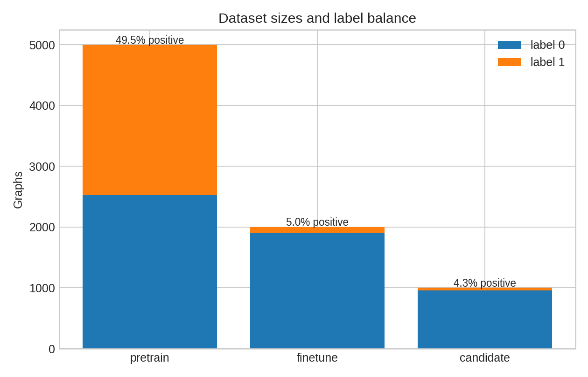
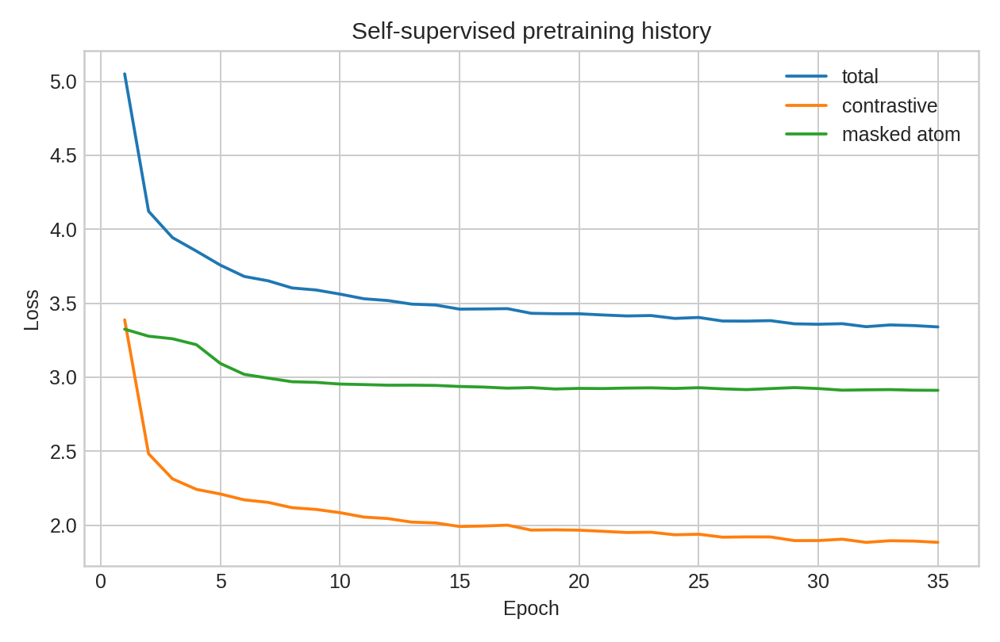
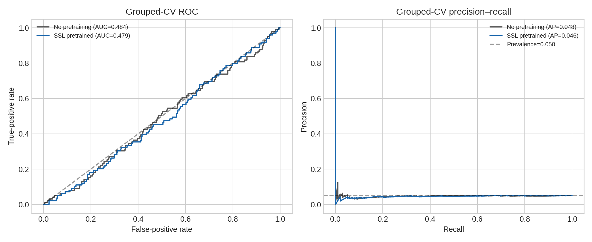
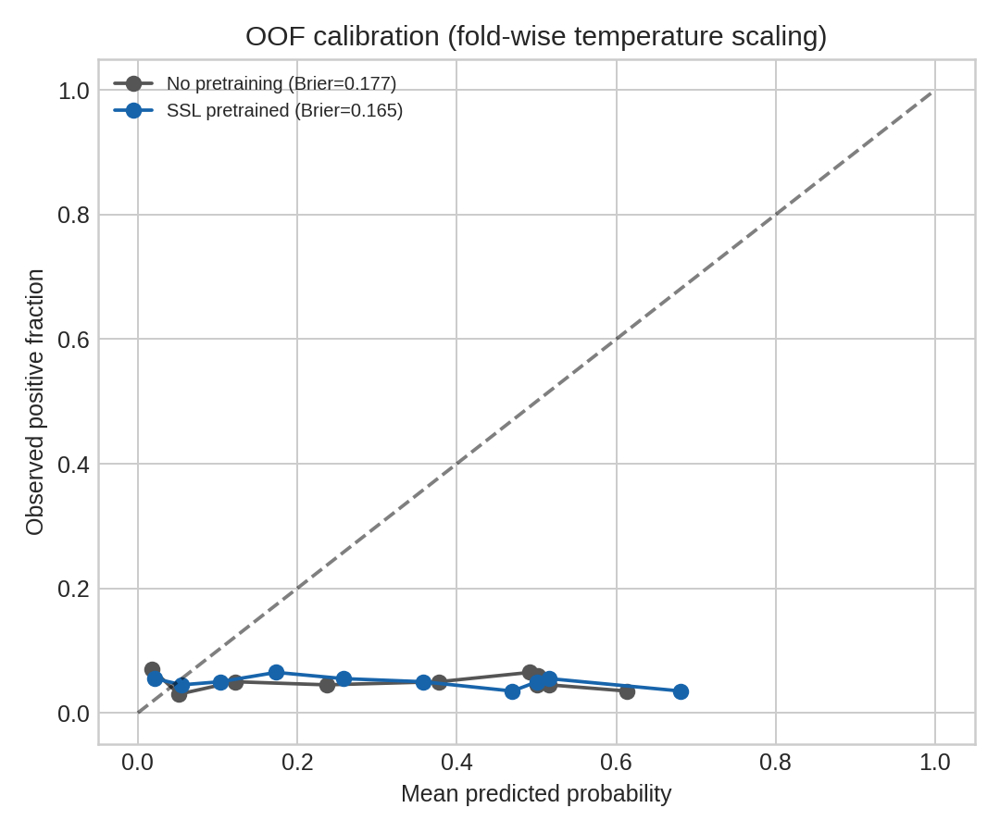
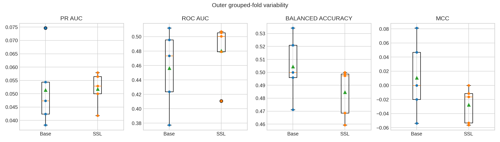
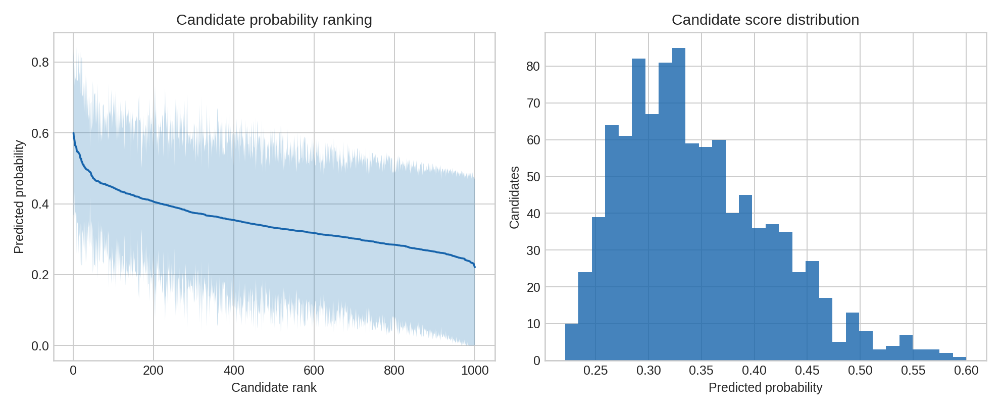

# Crystal-graph altermagnet screening under leakage-controlled validation reveals representation insufficiency

## Abstract

Altermagnet discovery requires more than recognizing chemical composition or a reduced connectivity pattern. The target phase is defined by magnetic order, joint spin-space symmetry, and electronic structure. Here we evaluate whether a supplied reduced crystal-graph representation can support an altermagnet search engine under a leakage-controlled and imbalance-aware benchmark. The graph archives contain 5,000 pretraining graphs, 2,000 fine-tuning graphs with 99 positives, and 1,000 candidate graphs whose 43 positive labels were withheld until a locked post-selection audit. We use an edge-aware graph neural network with contrastive and masked-atom self-supervised pretraining, then compare it with an identical randomly initialized baseline using nested stratified grouped cross-validation by graph fingerprint. Candidate labels are excluded from training, calibration, model selection, and ranking.

The baseline gives pooled out-of-fold PR-AUC 0.04849 and ROC-AUC 0.48439, whereas the SSL-pretrained model gives PR-AUC 0.04610 and ROC-AUC 0.47865. Both discrimination measures are at or below the fine-tuning prevalence of 0.0495 and the ROC random-ranking reference of 0.5. SSL improves calibration, reducing Brier score from 0.17750 to 0.16536 and log loss from 0.52611 to 0.49869, but does not improve ranking discrimination. The baseline is therefore selected using only out-of-fold PR-AUC before candidate labels are opened. In the locked candidate audit, PR-AUC is 0.04303 and ROC-AUC is 0.46818. The top 10 and top 25 ranked candidates contain no positives, while the top 50 and top 100 contain two and five positives, respectively. The scores are provisional model outputs, not validated altermagnets.

The negative result is scientifically useful. The graph schema contains elemental one-hot node features and two edge attributes, but no coordinates, lattice, space group, magnetic moments, magnetic order, energies, or provenance identifiers. These omissions remove variables that the altermagnet literature identifies as physically decisive, including the full crystal environment, spin-space symmetry, and SOC-independent spin splitting or spin texture [1-3]. The present benchmark therefore establishes a defensible boundary: the supplied representation does not support reliable altermagnet discovery, and a real search engine must recover provenance-linked structures, encode magnetic order and symmetry, and validate candidates with spin-polarized first-principles calculations before assigning physical classifications.

## Introduction and related work

Altermagnetism occupies a distinct position between conventional ferromagnetism and antiferromagnetism. Compensated magnetic order can coexist with momentum-dependent spin splitting even when the net magnetization vanishes and spin-orbit coupling is absent. The defining mechanism is tied to crystal rotations that connect opposite-spin sublattices and to the full magnetic crystal environment, including nonmagnetic atoms [1]. The resulting spin-dependent electronic structure can have alternating sign and d-wave, g-wave, or i-wave symmetry [1]. These properties are not determined by composition alone.

A symmetry description that includes both spatial and spin operations is therefore central to the problem. Spin space groups jointly characterize magnetic structure and its allowed electronic states, and they remain applicable in the negligible or weak spin-orbit coupling regime relevant to nonrelativistic altermagnetic splitting [2]. The associated spin texture can be fixed by the spin-space symmetry rather than by a generic structural similarity measure [2]. Recent work extends the discussion beyond collinear order to chiral non-collinear altermagnets and connects the classification to first-principles spin textures and transport responses [3]. This broader view makes the information requirement even more demanding: magnetic order, symmetry, and electronic structure must be treated as linked variables.

Materials informatics can still help when the descriptors are physically meaningful and the candidate family is scoped to a regime in which the descriptors carry transferable information. The ME-AI framework, for example, uses curated experimental descriptors and expert rules to guide classification across related material families [4]. That contrast is important for altermagnet screening. A graph model may learn useful chemical or topological regularities, but a high score cannot substitute for the magnetic and electronic evidence that defines the target phase.

The present study addresses this representation question directly. It does not treat a ranked graph as a discovered material. Instead, it asks whether the available graph fields contain enough information for a model to discriminate positives under realistic imbalance, whether self-supervised learning improves that discrimination, and whether the selected model enriches a finite candidate budget when candidate labels remain locked until after ranking.

*Figure 1. Dataset sizes and label balance. The pretraining archive is approximately balanced, whereas the fine-tuning and candidate archives contain 4.95% and 4.30% positives, respectively. Labels stored in the pretraining archive were not used in self-supervised learning, and candidate labels were opened only for the external audit.*

## Research hypothesis/objectives

The hypothesis was that an edge-aware graph encoder, initialized either randomly or by self-supervised learning on the leakage-filtered pretraining corpus, could learn structural signatures associated with the binary altermagnet label and rank candidates more effectively than random ordering.

The benchmark had four objectives:

1. Determine whether the reduced graph representation supports discrimination under nested stratified grouped validation with graph-fingerprint leakage control.
2. Test whether contrastive plus masked-atom self-supervised pretraining improves discrimination or probability calibration relative to an architecture-matched no-pretraining baseline.
3. Select a model using only fine-tuning out-of-fold predictions, then evaluate candidate ranking with labels withheld until the external audit.
4. Interpret the result against the physical requirements of altermagnetism and define a staged route to first-principles-validated discovery.

The primary conclusion is calibrated to these objectives. The benchmark does not establish a search engine for DFT-confirmed altermagnets. It establishes that the supplied reduced graph representation is insufficient for that purpose under the tested protocol and identifies the missing information required for a physically grounded successor.

## Data and methods

### Data schema and dataset composition

Each graph is a PyTorch Geometric `Data` object with node features `x` of shape `[nodes, 28]`, directed connectivity `edge_index` of shape `[2, E]`, edge features `edge_attr` of shape `[E, 2]`, and a binary label `y`. The node features are float32 one-hot encodings over 28 elements. The graph fields do not include atomic coordinates, lattice vectors, space group, magnetic moments, magnetic order, energies, or provenance identifiers. The label is ignored during self-supervised pretraining. Candidate labels are used only after the ranking is locked.

| Graph set | Number of graphs | Label 0 | Label 1 | Positive fraction | Label handling |
|---|---:|---:|---:|---:|---|
| Pretraining | 5,000 | 2,526 | 2,474 | 49.48% | Labels present in the archive but ignored in SSL |
| Fine-tuning | 2,000 | 1,901 | 99 | 4.95% | Used for nested grouped CV |
| Candidates | 1,000 | 957 | 43 | 4.30% | Labels disclosed only after locked ranking |

The archives contain no within-dataset duplicate graph fingerprints, and there is no exact fingerprint overlap between the pretraining, fine-tuning, and candidate sets. The self-supervised corpus therefore contains all 5,000 pretraining graphs after deduplication and cross-dataset exclusion.

### Safe loading and validation

The graph archives were loaded without unrestricted pickle deserialization. The loading procedure first inspected the static `GLOBAL` entries in each archive, compared them with a minimal explicit allowlist for the supplied PyTorch and PyTorch Geometric container types, and then used `torch.load(weights_only=True)` with the required compatibility classes. Graph validation checked required fields, tensor dimensions, edge bounds, and binary labels, and recorded the one-hot row-sum and edge-feature summaries. This procedure provides a reproducible loading boundary while preserving the supplied tensor data.

### Edge-aware graph model

The encoder maps the 28-dimensional node features into a hidden dimension of 96 and applies three message-passing layers. Each layer transforms the two-dimensional edge attributes with an edge-feature multilayer perceptron, combines the resulting edge representation with source-node features, aggregates messages at the destination nodes, and applies a residual update with layer normalization. Mean and max graph pooling are concatenated before a binary classification head. The baseline uses this same architecture and training procedure but starts from random weights.

### Self-supervised pretraining

Self-supervised learning uses two independent augmented views of each graph. In each view, node types are masked independently at a rate of 18% and edges are dropped independently at a rate of 10%. The objective combines graph-level NT-Xent contrastive loss with masked atom-type cross-entropy:

\[
L_{SSL}=L_{NT\text{-}Xent}+0.5L_{mask},
\]

with contrastive temperature 0.2 and 35 training epochs. The total loss decreases from 5.0503 to 3.3401. This decline demonstrates optimization of the pretraining objective, but it does not by itself demonstrate downstream usefulness for altermagnet discrimination.

*Figure 2. Self-supervised optimization history. The total, contrastive, and masked atom-type losses decrease during training. The loss trajectory is evidence that the SSL objective was optimized, not evidence that the learned representation contains the magnetic and symmetry variables required for altermagnet discovery.*

### Fine-tuning, calibration, and model selection

Fine-tuning uses five outer stratified grouped folds, with groups defined by the permutation-invariant graph fingerprint. Each outer test set contains 400 graphs and 19 or 20 positives. The corresponding development set is split into 1,280 training graphs and 320 validation graphs using a nested grouped stratified split. No fingerprint group crosses the train, validation, and test boundaries.

Positive class weighting is computed from each training fold only. Early stopping uses validation PR-AUC. Temperature scaling and threshold selection are also fit on validation predictions only. The primary model-selection criterion is pooled out-of-fold PR-AUC, with ROC-AUC and lower Brier score as tie-breakers. Candidate labels are not used at any stage of model selection, calibration, or ranking.

Uncertainty intervals for pooled PR-AUC and ROC-AUC use stratified bootstrap resampling of positive and negative out-of-fold examples, with 500 replicates. Paired baseline versus SSL differences use 1,000 paired bootstrap replicates. Lower Brier score indicates better probabilistic accuracy.

### Candidate ranking and locked audit

Each candidate receives a score from every outer-fold model after fold-specific validation temperature scaling. The reported score is the mean across the five outer-fold models, and the reported uncertainty is the standard deviation across folds. Ranking uses one representative per candidate fingerprint and excludes any structure overlapping the fine-tuning set. In the supplied archives, no fine-tuning overlap or candidate duplicate changes the eligible list. The candidate labels remain locked until model selection and ranking are complete. The external audit then evaluates the selected baseline over all 1,000 candidates and at fixed retrieval budgets of 10, 25, 50, and 100.

## Results

### Discrimination and calibration

The no-pretraining baseline is selected because it has the higher pooled out-of-fold PR-AUC. Its PR-AUC is 0.0484927352, compared with 0.0460954265 for the SSL-pretrained model. The fine-tuning prevalence is 0.0495, so both PR-AUC values are at or below the prevalence reference. ROC-AUC is also below 0.5 for both variants. The intervals overlap the weak-discrimination regime and do not support a reliable ranking advantage. The baseline selection is therefore a protocol result, not evidence that the baseline is physically informative.

| Model | Pooled OOF PR-AUC | 95% CI | Pooled OOF ROC-AUC | 95% CI | Brier | Log loss | ECE, 10 bins |
|---|---:|---|---:|---|---:|---:|---:|
| No pretraining baseline | 0.0484927352 | [0.0414288987, 0.0631907351] | 0.4843862082 | [0.4308292021, 0.5337756842] | 0.1774986564 | 0.5261099138 | 0.3003661094 |
| SSL-pretrained | 0.0460954265 | [0.0411013521, 0.0572863911] | 0.4786476017 | [0.4311777693, 0.5307619860] | 0.1653597141 | 0.4986861945 | 0.2644947970 |

The paired differences, calculated as SSL minus baseline on the same out-of-fold examples, separate calibration from discrimination. SSL changes PR-AUC by -0.0023973 with a 95% interval of [-0.0161277, 0.0058353] and ROC-AUC by -0.0057386 with a 95% interval of [-0.0639503, 0.0514106]. The Brier difference is -0.0121389 with a 95% interval of [-0.0192761, -0.0050777]. Thus, SSL improves probabilistic calibration in this benchmark, but the improvement does not translate into better positive ranking.

*Figure 3. Out-of-fold discrimination. The ROC curves remain close to the random-ranking diagonal, and the precision-recall curves remain close to the fine-tuning prevalence reference. The SSL-pretrained model does not improve either ranking metric.*

### Calibration and fold variability

The reduction in Brier score and log loss indicates a modest improvement in the numerical quality of the predicted probabilities. ECE also decreases from 0.3003661094 to 0.2644947970. These gains should not be interpreted as evidence that the model has identified the physical target. A model can produce less extreme or better-centered scores while retaining little information about which samples are positive.

*Figure 4. Probability calibration. Validation-only temperature scaling improves the relationship between predicted scores and observed positive fractions for the SSL-pretrained model, as reflected by the lower Brier score. Calibration does not establish physical validity or ranking enrichment.*

Performance is also variable across outer folds. The five outer test sets contain only 19 or 20 positives each, so fold-level PR-AUC and threshold metrics are sensitive to a small number of examples. The pooled out-of-fold analysis is therefore the primary result, while fold variability is reported as uncertainty about transfer across graph groups rather than as evidence of a stable discovery signal.

*Figure 5. Fold-level variability. The distributions show substantial variation across the five grouped outer folds, consistent with weak and unstable discrimination in the imbalanced fine-tuning set.*

## Candidate screening outcome

The baseline is used for the locked candidate audit because it is selected by pooled out-of-fold PR-AUC before candidate labels are disclosed. The candidate pool has prevalence 0.043. Its audited PR-AUC is 0.0430339 and ROC-AUC is 0.4681782, which is consistent with near-random ranking at the candidate prevalence. Retrieval performance remains close to prevalence at larger budgets and is absent at the budgets most relevant to focused follow-up.

| Candidate budget k | Positives retrieved | Precision@k | Recall@k |
|---:|---:|---:|---:|
| 10 | 0 | 0.00 | 0.00000 |
| 25 | 0 | 0.00 | 0.00000 |
| 50 | 2 | 0.04 | 0.04651 |
| 100 | 5 | 0.05 | 0.11628 |

The candidate ranking is therefore not operationally useful for enrichment. The selected scores are mean fold-calibrated model outputs with fold standard deviations. They are not calibrated discovery probabilities, and the ranked records are not validated altermagnets.

*Figure 6. Candidate ranking. The mean score decreases gradually across the candidate pool, with broad fold-to-fold uncertainty. The post-selection audit shows no positives among the top 10 or top 25 and only near-prevalence retrieval at larger budgets.*

### Top ten provisional score-ranked records

The following entries are the ten highest-ranked unique novel candidate records under the selected baseline. The locked audit found zero positives in this top-ten list and zero positives in the top 25. Each score is the mean of the five fold-calibrated model outputs, and the uncertainty is the standard deviation across folds.

| Rank | Candidate ID | Composition | Selected score | Fold SD |
|---:|---|---|---:|---:|
| 1 | candidate_0593 | FeCrPrGdHoErF2BrI | 0.6001609 | 0.2326031 |
| 2 | candidate_0927 | FeHoClBr2SeTeB | 0.5848246 | 0.2144727 |
| 3 | candidate_0770 | FeVClBrTeC | 0.5829542 | 0.1493631 |
| 4 | candidate_0280 | FeNiMnGdFClBrSCSi | 0.5746100 | 0.2163131 |
| 5 | candidate_0380 | FeCrFBr | 0.5648119 | 0.1944858 |
| 6 | candidate_0171 | Fe2NdHoFClBr2ITeCH | 0.5638833 | 0.1859293 |
| 7 | candidate_0236 | SmHoFBrSeNSiH | 0.5614349 | 0.2067000 |
| 8 | candidate_0075 | FePrSmHoClBr | 0.5592878 | 0.1879280 |
| 9 | candidate_0045 | FePr2GdClTe | 0.5504919 | 0.2919896 |
| 10 | candidate_0288 | NiCrVPrGdHoErYbBrI | 0.5475156 | 0.2030638 |

These records are suitable only as provisional score-ranked inputs to a future structure and magnetic-order validation pipeline. They cannot be called discoveries, confirmed altermagnets, metals, insulators, or d-wave, g-wave, or i-wave materials on the basis of the supplied graph scores.

## Discussion

The central finding is a representation result. Under a validation design that blocks exact graph-fingerprint leakage, respects the 4.95% fine-tuning prevalence, locks candidate labels, and reports paired uncertainty, the reduced crystal graph does not provide a reliable altermagnet discovery signal. The baseline and SSL-pretrained models both rank positives at or below prevalence behavior. The candidate audit reproduces the same conclusion outside the fine-tuning cross-validation loop.

The SSL result is informative rather than contradictory. The contrastive and masked-atom objective is optimized, with total loss decreasing from 5.0503 to 3.3401. Fine-tuning the resulting encoder improves Brier score, log loss, and ECE, which indicates that the representation can support a modest adjustment of score scale or confidence. Its PR-AUC and ROC-AUC are not improved, however. In this setting, learning a smoother or better-centered output is easier than learning the ordering that separates altermagnets from non-altermagnets.

The most direct explanation is that the graph fields omit variables that define the physical class. The supplied node features describe elemental identity, and the edge attributes describe a reduced pairwise relation. Neither field specifies where atoms sit in a lattice, which space-group operations connect sites, whether moments are present, how moments are ordered, or how the magnetic structure changes the electronic Hamiltonian. The crystal-rotation connection between opposite-spin sublattices and the role of the full magnetic crystal environment are central to the original altermagnetism framework [1]. Spin-space groups require joint spatial and spin operations and determine allowed spin textures in appropriate SOC regimes [2]. Non-collinear and chiral extensions further connect the target to magnetic order, symmetry, and first-principles spin textures and transport [3]. The present results do not support the assumption that a reduced composition-connectivity graph encodes these facts indirectly and reliably.

This interpretation also clarifies why composition-heavy candidates can receive moderate scores without being useful discoveries. The top-ranked records contain combinations of transition metals, rare earths, halogens, and light elements that may be chemically distinctive, but the score does not identify a magnetic order or a symmetry-protected spin splitting. The large fold standard deviations, including 0.2919896 for candidate_0045, further show that the score is not a stable physical probability. The locked audit, with no positives in the top 10 or top 25, is the decisive test for a limited experimental or computational budget.

The benchmark therefore changes the next question. The immediate task is not to tune the same graph model more aggressively. It is to construct an input representation whose variables correspond to the physical definition of altermagnetism, then evaluate it with the same leakage and label-lock controls. Materials-informatics work based on physically meaningful, expert-curated descriptors and scoped families provides a useful contrast [4]. For altermagnets, that principle points toward provenance-linked structures, magnetic-order enumeration, symmetry-aware descriptors, and first-principles confirmation rather than a larger collection of composition-only graphs.

## Limitations

The main limitation is intrinsic to the supplied data. The graphs do not contain coordinates, lattice vectors, space-group information, magnetic moments, magnetic order, energies, or provenance identifiers. Consequently, the benchmark cannot test whether a particular crystal realizes a permitted spin-space group, whether it has a compensated magnetic ground state, or whether it exhibits SOC-independent momentum-dependent spin splitting.

The binary labels also do not provide an electronic-structure record that would allow independent physical adjudication. No DFT calculations, band structures, spin textures, transport calculations, or convergence records are present in the supplied outputs. The report therefore does not claim metallicity, insulating character, d-wave, g-wave, or i-wave classification for any graph or candidate.

The fine-tuning set contains only 99 positives, and each outer test fold contains 19 or 20 positives. This limits the precision of fold-level estimates, although the grouped nested design, pooled out-of-fold metrics, paired bootstrap intervals, and locked candidate audit provide the appropriate evidence for the present decision. The result is a statement about the supplied representation and benchmark, not a universal statement that graph learning cannot contribute to altermagnet discovery after the missing physical variables are added.

## Proposed first-principles validation workflow

A physically defensible search engine should use the current graph benchmark only as an initial data and ranking layer. Candidate acceptance should proceed through the following stages.

1. **Recover provenance-linked structures.** Map each candidate record to a unique crystal identifier and retrieve its CIF or equivalent structure, lattice vectors, atomic coordinates, composition, and database provenance. Reject records that cannot be traced to an explicit structure.
2. **Enumerate or import magnetic order.** Generate chemically and structurally plausible collinear and non-collinear magnetic configurations, including inequivalent magnetic sublattices and relevant moment directions. The magnetic state must be an explicit model input, not an inferred label attached to composition.
3. **Apply crystallographic and spin-space symmetry filters.** Determine the crystallographic symmetry of the structure and evaluate candidate magnetic configurations using magnetic space-group or spin-space-group analysis. Retain configurations whose symmetry permits compensated order and the relevant altermagnetic spin transformation, including the weak-SOC regime where appropriate [1,2].
4. **Run spin-polarized first-principles calculations without SOC.** Relax or otherwise establish the intended magnetic configuration using documented convergence criteria, then calculate the band structure and momentum-dependent spin splitting or spin texture with SOC disabled. This step tests the nonrelativistic mechanism rather than relying on a proxy label.
5. **Assess SOC-on robustness and transport when relevant.** Repeat the electronic-structure analysis with SOC when the material's chemistry or target application requires it. For suitable candidates, evaluate spin Hall, Edelstein, or related transport signatures using the converged spin texture and a method appropriate to the system [3].
6. **Check stability, energetics, and numerical convergence.** Compare competing magnetic configurations, inspect formation-energy or related stability measures, and verify convergence with respect to the numerical settings that affect the reported bands and moments. The goal is to distinguish a symmetry-allowed metastable calculation from a physically plausible material state.
7. **Perform expert review before assigning a discovery label.** Review the structure, magnetic order, symmetry analysis, SOC-off splitting or texture, SOC-on behavior, stability evidence, and provenance together. Only candidates that pass this chain should be reported as altermagnets. Metal or insulator status and d-wave, g-wave, or i-wave terminology should be assigned only when supported by the corresponding electronic-structure analysis [1].

This workflow preserves a useful role for machine learning. A structure-aware model can prioritize the costliest calculations, but its score should remain a triage variable until the magnetic and electronic checks are complete.

## Conclusion

The supplied reduced crystal graphs do not support a reliable altermagnet discovery engine under leakage-controlled, imbalance-aware validation. The no-pretraining baseline has pooled OOF PR-AUC 0.04849 and ROC-AUC 0.48439, while SSL pretraining gives 0.04610 and 0.47865. SSL improves calibration, lowering Brier score from 0.17750 to 0.16536 and log loss from 0.52611 to 0.49869, but it does not improve discrimination. The baseline is selected without candidate labels, yet the locked candidate audit yields PR-AUC 0.04303, ROC-AUC 0.46818, zero positives in the top 10 and top 25, two in the top 50, and five in the top 100.

The result is not a failed search for a universal reason. It is a precise diagnosis of the present representation. Altermagnetism depends on magnetic order, spin-space symmetry, the full crystal environment, and electronic-structure observables that are absent from the supplied graphs [1-3]. The next credible search engine should therefore combine provenance-linked crystal structures with magnetic-order and symmetry-aware representations, use ML to prioritize candidates, and reserve physical claims for candidates that pass spin-polarized first-principles validation. That is the route from a reproducible negative benchmark to a scientifically meaningful discovery pipeline.

## Scientific Reasonableness Check

| Check | Status | Evidence-supported interpretation |
|---|---|---|
| Claim-evidence fit | Pass | The report claims representation insufficiency and failed enrichment, not altermagnet discovery or DFT confirmation. |
| Leakage control | Pass | Static archive inspection, deduplication, no cross-dataset fingerprint overlap, and grouped train, validation, and test splits are documented. |
| Imbalance-aware primary metric | Pass | Pooled OOF PR-AUC is primary for the 4.95% positive fine-tuning set; ROC-AUC is reported as a complementary measure. |
| Model comparison | Pass | Baseline and SSL variants use the same edge-aware architecture and matched grouped folds. |
| Calibration assessment | Pass | Brier score, log loss, and ECE are reported; lower Brier score is interpreted as better probabilistic accuracy. |
| Uncertainty | Pass | Bootstrap intervals for pooled metrics and paired baseline versus SSL differences are included; fold variability is shown. |
| Candidate label lock | Pass | Candidate labels are described as a post-selection external audit and are not used for model selection, calibration, or ranking. |
| Ranking interpretation | Pass | Candidate scores are identified as mean fold-calibrated outputs with fold SD, not validated discovery probabilities. |
| Physical validation boundary | Pass | No claims are made about DFT confirmation, metallicity, insulating character, spin texture, or d/g/i-wave class. |
| Literature fit | Pass | The four supplied papers are used only for the stated symmetry, magnetic-order, first-principles, and materials-informatics context. |

## Reproducibility/data artifacts

The report is reproducible from the supplied local artifacts and the existing analysis implementation. The principal records are:

| Artifact | Relative path from this report | Role |
|---|---|---|
| Dataset counts and graph statistics | `../outputs/dataset_overview.json` | Dataset sizes, class counts, graph dimensions, and feature summaries |
| Schema, safe loading, duplicates, and overlaps | `../outputs/schema_and_data_overview.json` | Graph fields, loading boundary, fingerprint checks, and SSL corpus size |
| Run configuration | `../outputs/run_config.json` | Model and validation settings needed to interpret the benchmark |
| Aggregate metrics and selection | `../outputs/metrics_summary.json` | Pooled metrics, bootstrap intervals, paired differences, selection rule, and candidate audit |
| Outer-fold metrics | `../outputs/fold_metrics.csv` | Per-fold performance and validation-derived calibration information |
| Out-of-fold predictions | `../outputs/oof_predictions.csv` | Paired predictions used for pooled discrimination and calibration analysis |
| Candidate ranking | `../outputs/candidate_rankings.csv` | Candidate scores, fold SD, and eligibility fields |
| Top candidate table | `../outputs/top_candidates.csv` | Unique novel score-ranked candidate records |
| Locked candidate audit | `../outputs/candidate_external_audit.json` | Post-selection candidate PR-AUC, ROC-AUC, and budget metrics |
| Self-supervised history | `../outputs/pretraining_history.csv` | Detailed SSL optimization history, summarized in the main text |
| Fine-tuning history | `../outputs/finetuning_history.csv` | Detailed fold training histories, retained as supporting content |
| Grouped split assignments | `../outputs/grouped_cv_splits.csv` | Train, validation, and test membership by fold and fingerprint |
| Analysis implementation | `../code/run_crystal_graph_pipeline.py` | Safe loading, fingerprinting, model definition, validation, ranking, and figure generation |

Serialized model paths, exact per-fold thresholds and temperatures, complete confusion matrices, the full 25-candidate table, the explicit safe-global allowlist, and detailed training histories are retained as supporting computational records rather than repeated in the main argument.

## References

1. Šmejkal, L., Sinova, J. & Jungwirth, T. Beyond Conventional Ferromagnetism and Antiferromagnetism: A Phase with Nonrelativistic Spin and Crystal Rotation Symmetry. *Physical Review X* **12**, 031042 (2022). DOI: 10.1103/PhysRevX.12.031042.
2. Xiao, Z., Zhao, J., Li, Y., Shindou, R. & Song, Z.-D. Spin Space Groups: Full Classification and Applications. *Physical Review X* **14**, 031037 (2024). DOI: 10.1103/PhysRevX.14.031037.
3. Hu, M., Janson, O., Felser, C., McClarty, P., van den Brink, J. & Vergniory, M. G. Spin Hall and Edelstein effects in chiral non-collinear altermagnets. *Nature Communications* **16**, 8529 (2025). DOI: 10.1038/s41467-025-64271-8.
4. Liu, Y., Jovanovic, M., Mallayya, K., Maddox, W. J., Wilson, A. G., Klemenz, S., Schoop, L. M. & Kim, E.-A. Materials Expert-Artificial Intelligence for materials discovery. *Communications Materials* **6**, 212 (2025). DOI: 10.1038/s43246-025-00928-7.

## Supporting information

The supporting content for this report is retained in the same Markdown file and in the supplied artifact directories. It includes the exact per-fold thresholds and temperatures, all fold confusion matrices, the complete 25-candidate ranking, serialized model references, the inspected safe-global allowlist, and detailed pretraining and fine-tuning histories. These records support reproducibility without changing the main scientific conclusion: the current reduced graph representation can be benchmarked safely, but it cannot support reliable physical discovery claims for altermagnetism without magnetic, symmetry, structural, and electronic-structure information.
