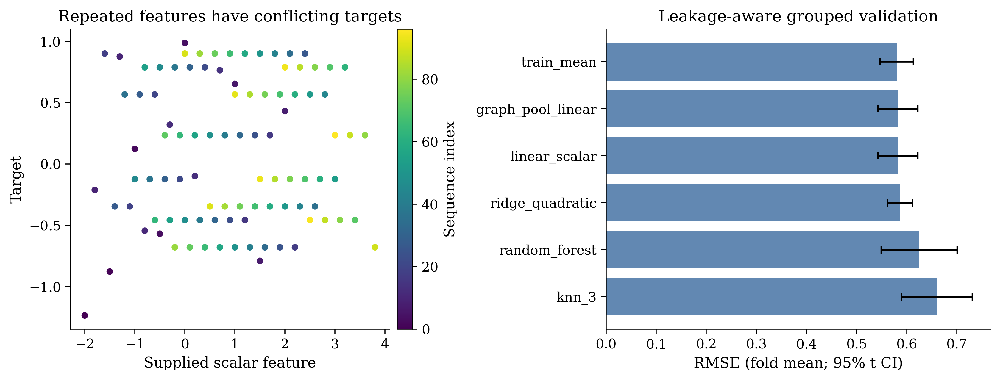
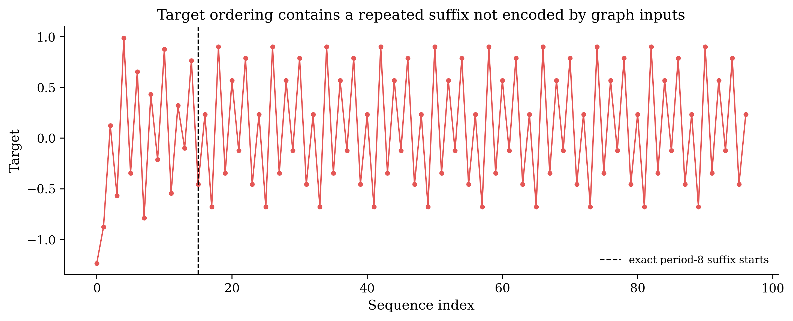
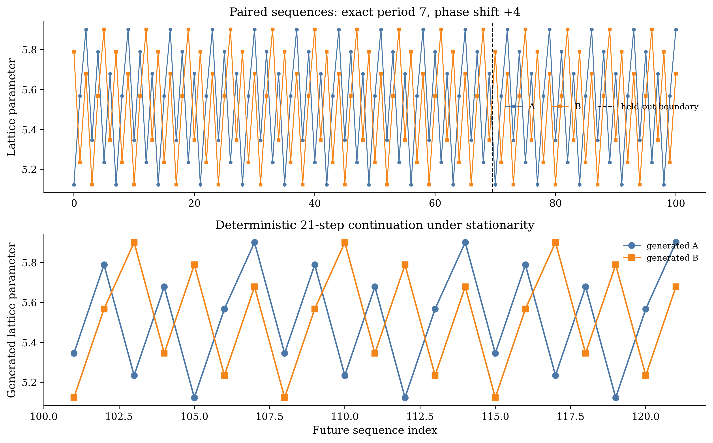
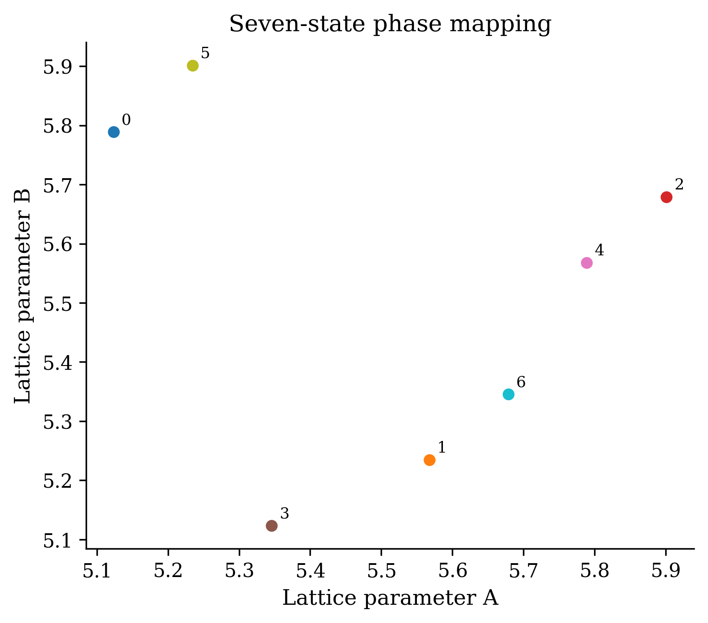
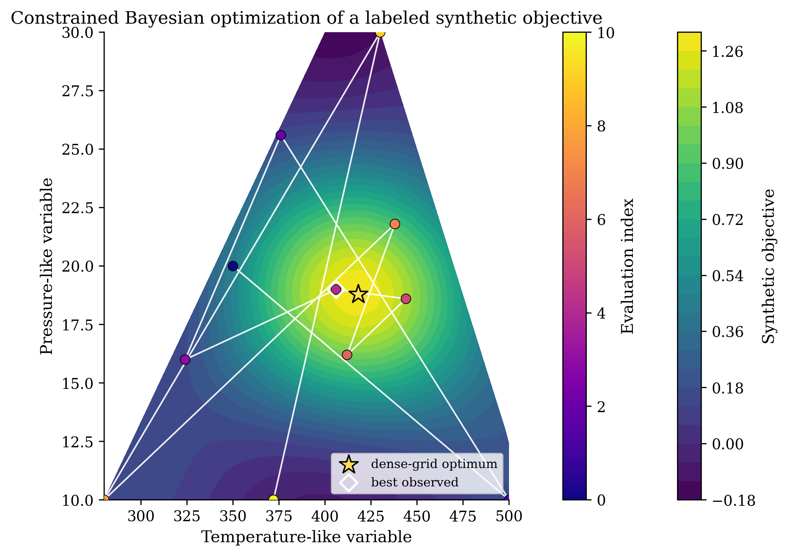
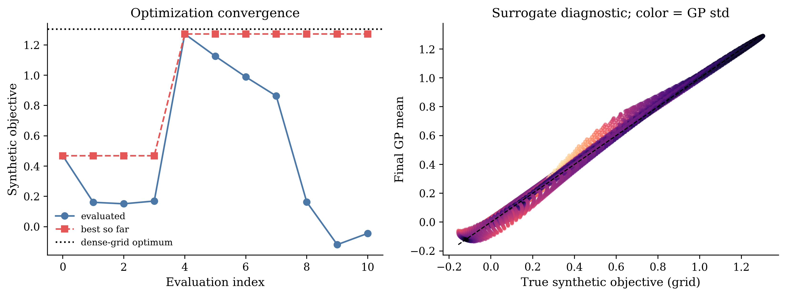

# Benchmark forensics delimit property learning, cyclic structure continuation, and synthetic optimization in M-AI-Synth

## Abstract

Small materials-AI benchmarks are useful only when their data-generating assumptions and evaluation boundaries are explicit. Here we apply a benchmark-forensics-first analysis to the M-AI-Synth benchmark, a tiny synthetic benchmark containing a property-prediction block, a structure-sequence block, and an optimization block. Conservative parsing of the malformed property-prediction block yields 97 aligned records from raw sequences of lengths 100, 117, 20, and 97. Every aligned sample has the same complete graph K5 topology, and 37 repeated feature values have conflicting targets. Under grouped-by-exact-feature validation and forward-blocked validation, no tested model improves on the train-mean baseline by mean RMSE. The best grouped result is RMSE 0.5799978529568884 with a 95% fold confidence interval of 0.5465483913064826 to 0.6134473146072943; the best forward-blocked result is RMSE 0.5562830005782018 with a 95% fold confidence interval of 0.5155621275238361 to 0.5970038736325675.

The two structure sequences are exact period-7 cycles with a +4 phase mapping. A prefix/suffix evaluation using 70 training points and 31 held-out points gives RMSE 6.577242139170587e-16 and maximum absolute error 8.881784197001252e-16. These values are numerical residuals from exact synthetic repetition, not physical accuracy or calibrated uncertainty. The optimization stage is a synthetic constrained Bayesian optimization demonstration because no measured response was supplied. With 11 total evaluations, constrained expected improvement reaches a best synthetic objective of 1.2719862518209806 at (406, 19), compared with 1.3041301935917395 at (418, 18.8) on the dense feasible grid, giving simple regret 0.032143941770758966. The benchmark therefore supports a transparent three-stage demonstration of parsing, leakage-aware validation, cyclic continuation, and constrained acquisition mechanics. It does not support claims of generalizable multimodal materials discovery, physical structure generation, experimental optimization, or autonomous synthesis.

## 1 Introduction and literature context

Materials-AI workflows connect several scientific data types and decisions. Crystal structures can be represented as graphs, computed properties can provide screening labels, physical models can constrain inference, and reaction histories can guide synthesis choices. The scientific value of such a workflow depends on more than whether each software component executes. It depends on whether the input schema identifies the intended scientific objects, whether validation prevents leakage, whether the target is physically grounded, and whether the final claim matches the evidence.

The Materials Project established an important precedent for organizing computational materials data as an accessible and quality-annotated resource. Its infrastructure links structures, calculated properties, workflow automation, and experimental follow-up, while also documenting that high-throughput labels can contain systematic errors and physical edge cases [1]. Physics-informed machine learning provides a broader framework for combining data with symmetries, physical residuals, multi-fidelity information, and uncertainty-aware selection, while emphasizing the need for appropriate benchmarks and stable problem formulations [2]. Crystal Graph Convolutional Neural Networks (CGCNNs) show how periodic crystal graphs can support structure-property prediction when the dataset contains diverse crystal structures and chemically meaningful labels [3]. Model-guided synthesis studies further show that process variables, failed experiments, and family-aware splits can support prospective experimental prioritization [4].

These papers position the components of a materials-AI workflow, but they do not justify transferring their reported accuracies, synthesis success rates, or experimental conclusions to a tiny synthetic benchmark. In particular, the supplied literature does not establish a validated end-to-end multimodal model, a general crystal generator, or a fully autonomous laboratory. A small benchmark can still be scientifically useful if it exposes the conditions under which each workflow component is identifiable and the conditions under which it is not.

The M-AI-Synth benchmark provides a compact setting for this test. Its three blocks appear to correspond to property learning, structure continuation, and constrained optimization, but each block has a distinct evidence boundary. The central contribution of this report is therefore not a claim of model superiority. It is a calibrated account of what the benchmark can demonstrate, what it cannot identify, and why negative property-prediction performance is itself a valid result. The analysis is organized around conservative parsing, leakage-aware evaluation, exact periodicity detection, and explicit separation of synthetic Bayesian-optimization mechanics from real experimental validation.

## 2 Data and problem formulation

### 2.1 Data overview and schema inference

The benchmark is a text-based collection of 12 bracketed arrays. The arrays do not form a single homogeneous table. We interpret them as three blocks and retain unmatched tails rather than silently treating them as additional samples.

| Block | Raw sequence lengths | Conservative interpretation | Evidence boundary |
|---|---:|---|---|
| Property-prediction block | Node counts 100; scalar features 117; flattened edge indices 20; targets 97 | Align the first 97 node-count, feature, and target entries. Interpret the 20 edge indices as 10 undirected edges forming a complete graph K5. | The aligned rows are benchmark records, not established distinct materials. The unmatched tails are not modeled. |
| Structure-sequence block | Sequence A 101; sequence B 101 | Pair the sequences by sequence index and infer a repeating phase rule. | The sequences provide numerical continuation evidence, not atomistic coordinates or a physical structure distribution. |
| Optimization block | Bounds of length 2 for each variable; one initial point; one exploration parameter; one iteration count | Interpret the variables as temperature-like and pressure-like coordinates for synthetic constrained Bayesian optimization. | No measured response is supplied. All objective values are synthetic. |

The property-prediction block has raw lengths 100, 117, 20, and 97 for node counts, scalar features, flattened edge indices, and targets, respectively. Conservative alignment produces 97 records, with three unmatched node-count entries and 20 unmatched scalar-feature entries. Every aligned node count is 5. The edge list contains the ten undirected edges of a complete graph K5. Because all records share one topology and no per-node grouping is supplied for the scalar sequence, the scalar feature is treated as a graph-level or node-broadcast feature. This interpretation avoids assigning unsupported structure to the input.

The structure-sequence block contains two paired sequences of length 101. We use sequence index as the pairing coordinate and reserve the final 31 points for held-out evaluation after fitting on a 70-point prefix. The optimization block contains bounds of 200 to 500 for a temperature-like variable and 10 to 30 for a pressure-like variable, an initial point at (350, 20), an inferred exploration parameter of 0.1, and 10 additional acquisition iterations. Because no response measurements accompany these inputs, the optimization stage is defined as a synthetic constrained Bayesian optimization demonstration.

### 2.2 Research questions and hypotheses

The analysis addresses three questions.

1. **Property learning.** Does the property-prediction block contain predictive information beyond a mean baseline when exact repeated features are kept in the same fold and temporal ordering is respected?
   
   The hypothesis was that at least one scalar or graph-pooling model would improve on the train-mean baseline under grouped-by-exact-feature validation or forward-blocked validation.

2. **Structure continuation.** Does the structure-sequence block contain a repeatable rule that supports held-out continuation from a prefix?
   
   The hypothesis was that a transparent period and phase model would recover the held-out suffix if the sequences were generated by a stationary cyclic rule.

3. **Constrained optimization mechanics.** Can a Gaussian process (GP) with expected improvement (EI) select feasible candidates and approach the best point on a dense feasible grid when evaluated against an explicitly synthetic objective?
   
   The hypothesis was that synthetic constrained Bayesian optimization would identify a high-value feasible point within the fixed evaluation budget. This hypothesis concerns acquisition mechanics only. It does not concern experimental optimization or a material response.

## 3 Methods

### 3.1 Conservative alignment and structural diagnostics

The property-prediction block was aligned by the minimum common length of the node-count, scalar-feature, and target sequences. The edge-index sequence was reshaped into source and target pairs and checked against five-node indexing. The analysis reported the discarded tails, the number of unique scalar values, repeated scalar values, and repeated values associated with conflicting targets.

The aligned graph input is a complete graph K5 with five nodes and ten undirected edges. Since the same topology appears in every row, graph topology cannot be evaluated as a source of variation. For the graph-pooling baseline, the scalar feature was transformed into deterministic pooled quantities equivalent to a broadcast feature over five nodes, together with the fixed edge count. Under these inputs, graph pooling is algebraically a transform of the same scalar feature rather than an independently informative graph representation.

### 3.2 Property models and leakage-aware validation

We evaluated six transparent baselines:

- `train_mean`, a mean predictor fitted on each training fold;
- `linear_scalar`, linear regression on the supplied scalar feature;
- `ridge_quadratic`, degree-2 polynomial expansion followed by standardization and ridge regression;
- `knn_3`, distance-weighted three-nearest-neighbour regression after standardization;
- `random_forest`, a 400-tree regressor with minimum leaf size 2;
- `graph_pool_linear`, linear regression on the deterministic graph-pooling features.

The primary evaluations used five folds under two leakage-aware schemes. **Grouped-by-exact-feature validation** assigned all rows with the same scalar feature value to the same fold. **Forward-blocked validation** used five chronological blocks with a test size of 12, so later targets were not available when earlier blocks were used for training. A naive shuffled five-fold split was retained as a diagnostic but was not used as the basis for scientific claims because the target sequence contains an exact periodic suffix.

Performance was summarized by root mean squared error (RMSE), mean absolute error (MAE), and coefficient of determination (R^2). Reported 95% intervals are t-based confidence intervals across the five fold-level metrics. They quantify split-to-split variation in this benchmark. They do not establish population-level uncertainty.

### 3.3 Period and phase inference for the structure-sequence block

For each sequence, candidate periods from 1 through 20 were scanned on the 70-point training prefix. The smallest period with zero numerical residual was selected. A phase table was then formed by averaging values at each phase within the prefix. The cross-sequence mapping was tested by shifting sequence A relative to sequence B over all phases. For the selected shift, the continuation rule is

\[
\hat{A}_i = \bar{A}_{i \bmod 7}, \qquad
\hat{B}_i = \bar{A}_{(i+4) \bmod 7}.
\]

The rule was evaluated on the 31-point suffix. A direct phase lookup for B, a linear model from A to B, and the train-mean baseline were included for comparison. The analysis also generated a deterministic 21-point continuation and seven unique phase-pair candidates under the assumption of a stationary exact cycle with no added stochastic jitter.

Residuals on the order of 10^-15 are treated as floating-point numerical residuals from exact synthetic repetition. They are not reported as physical accuracy, calibrated uncertainty, or evidence of physically certain structure generation.

### 3.4 Synthetic constrained Bayesian optimization

The optimization stage uses temperature-like coordinate \(t\) and pressure-like coordinate \(p\), with bounds

\[
200 \le t \le 500, \qquad 10 \le p \le 30.
\]

The objective is explicitly synthetic:

\[
\begin{aligned}
f_{\mathrm{syn}}(t,p) = &\;1.18\exp\left[-\frac{1}{2}\left(\left(\frac{t-420}{52}\right)^2 + \left(\frac{p-18.5}{3.8}\right)^2\right)\right] \\
&+ 0.17\sin\left(\frac{t-225}{38}\right)\cos\left(\frac{p-11}{3.1}\right) \\
&+ 0.12\exp\left[-\frac{1}{2}\left(\left(\frac{t-285}{38}\right)^2 + \left(\frac{p-26}{2.8}\right)^2\right)\right].
\end{aligned}
\]

Both constraints are synthetic and were applied at every evaluation:

\[
t + 4p \le 550,
\]

\[
t - 6p \ge 220.
\]

The initial point was (350, 20). A GP with a fixed radial basis function kernel was fitted after each evaluation, and EI with exploration parameter \(\xi=0.1\) selected the next point from a dense feasible grid. The grid used 151 temperature points and 101 pressure points before feasibility masking. The procedure used 10 additional iterations, for 11 total evaluations including the supplied initial point. No measured response was supplied. The true objective values reported for candidate diagnostics are therefore post hoc values of the same synthetic function, not observations from a material or process.

### 3.5 Determinism and scientific QC

The analysis used seed 20260810, fixed validation folds and splits, a fixed optimization grid, and a fixed GP kernel. The completed QC found finite numeric values in all exported CSV tables, valid edge indices for five nodes, held-out structure error below 10^-12, feasibility of every optimization evaluation, and nonnegative simple regret relative to the dense feasible grid. These checks establish internal consistency of the reported artifacts. They do not compensate for missing physical labels, missing topology variation, or absent experimental observations.

## 4 Results

### 4.1 Property prediction: malformed inputs and conflicting labels remove the basis for generalization claims

Conservative parsing produced 97 aligned property records. The graph component is constant across the entire aligned table: every record contains five nodes and the same complete graph K5 topology. The scalar feature sequence contains 55 unique values. Of these, 37 values are repeated, and all 37 repeated values are associated with conflicting targets. The same scalar input therefore does not define a unique target in this benchmark.

The group-mean assignment over all aligned rows gives an empirical same-feature oracle with RMSE 0.49055089049800416, MAE 0.40793780068728513, and R^2 0.28198550933296407. This is an in-sample diagnostic, not a held-out prediction result. It quantifies the ambiguity that remains even when the repeated feature value is used to assign its observed group mean.

The leakage-aware model comparison gives no evidence that a tested model improves on the train-mean baseline by mean RMSE. Under grouped-by-exact-feature validation, the train-mean model has RMSE 0.5799978529568884, with a 95% fold confidence interval of 0.5465483913064826 to 0.6134473146072943, MAE 0.5217560312669786, and R^2 -0.013584040479041359. Under forward-blocked validation, the train-mean model has RMSE 0.5562830005782018, with a 95% fold confidence interval of 0.5155621275238361 to 0.5970038736325675, MAE 0.5047216666666667, and R^2 -0.007902891083965136. The other models remain within the same error scale or perform worse.

| Model | Grouped RMSE (95% CI) | Grouped MAE | Grouped R^2 | Forward RMSE (95% CI) | Forward MAE | Forward R^2 |
|---|---:|---:|---:|---:|---:|---:|
| `train_mean` | 0.579998 (0.546548, 0.613447) | 0.521756 | -0.013584 | 0.556283 (0.515562, 0.597004) | 0.504722 | -0.007903 |
| `linear_scalar` | 0.582254 (0.542551, 0.621957) | 0.523170 | -0.021326 | 0.556699 (0.518689, 0.594708) | 0.503920 | -0.010350 |
| `ridge_quadratic` | 0.586741 (0.561721, 0.611761) | 0.524391 | -0.039705 | 0.563529 (0.524717, 0.602340) | 0.505029 | -0.035920 |
| `random_forest` | 0.624836 (0.549373, 0.700299) | 0.548627 | -0.183143 | 0.679232 (0.552385, 0.806079) | 0.607794 | -0.500893 |
| `graph_pool_linear` | 0.582254 (0.542551, 0.621957) | 0.523170 | -0.021326 | 0.556699 (0.518689, 0.594708) | 0.503920 | -0.010350 |
| `knn_3` | 0.660306 (0.589498, 0.731114) | 0.565838 | -0.317888 | 0.929035 (0.725920, 1.132150) | 0.834316 | -1.815673 |

*Table 1. Property-prediction performance under leakage-aware validation. Values are means across five folds. The intervals are 95% t-based confidence intervals across fold RMSE values. The train-mean model is the best grouped model and the best forward-blocked model by RMSE.*

*Figure 1 | Property-prediction diagnostics. The left panel shows target values against the supplied scalar feature, with color indicating sequence index. Repeated feature values occupy multiple target levels rather than a single response. The right panel shows grouped-by-exact-feature RMSE with 95% fold confidence intervals for the six tested baselines. The graph-pooling model does not provide an independent topology test because every sample has the same complete graph K5 and the scalar feature is broadcast or pooling-equivalent.*

The target sequence also contains an exact ordering pattern that is not encoded by the graph inputs. From index 15 onward, the target suffix has period 8 across 74 comparisons, with maximum absolute error 0.0. This pattern explains why shuffled validation would be a poor basis for a generalization claim. A model can appear to benefit from index-linked repetition without learning a relation between a material representation and its target.

*Figure 2 | Target ordering in the property-prediction block. The dashed line marks index 15, where the exact period-8 suffix begins. The repeated suffix is an ordering property of the synthetic target sequence and is not represented by the supplied graph topology or scalar feature. It is therefore a direct reason to prefer grouped-by-exact-feature validation and forward-blocked validation over naive shuffled evaluation.*

The property-prediction result is consequently a positive benchmark-forensics finding. The block does not provide evidence for graph learning, topology-dependent inference, or generalizable property prediction. It does provide a controlled demonstration that conservative alignment and leakage-aware validation can identify when a nominal graph-learning task has collapsed to an ambiguous scalar regression problem.

### 4.2 Structure generation: exact cyclic continuation without physical structure generation

Both structure sequences contain the same smallest exact period of 7 on the 70-point training prefix. The period scan also identifies multiples of 7 as exact repeats, as expected for a sequence with a fundamental period of 7. The best cross-sequence mapping shifts sequence A by +4 phases to reproduce sequence B. The phase-shift training RMSE is 6.713997766802521e-16, and the absolute residual 95th percentile is 8.881784197001252e-16.

The prefix/suffix evaluation confirms the mapping. The held-out suffix contains 31 points. The phase-shift model and the direct phase lookup both achieve RMSE 6.577242139170587e-16, MAE 4.870655849968428e-16, R^2 1.0, and maximum absolute error 8.881784197001252e-16. The train-mean and linear baselines have RMSE 0.2686169321928493 and 0.2617404150328221, respectively. The exact phase rule therefore explains the held-out sequence far better than the non-periodic baselines.

| Method | RMSE | MAE | R^2 | Maximum absolute error |
|---|---:|---:|---:|---:|
| Train mean | 0.2686169321928493 | 0.2440875576036866 | -0.0002918167755967538 | 0.3966571428571424 |
| Linear B from A | 0.2617404150328221 | 0.24179235873804314 | 0.050267019154831125 | 0.4354126301436878 |
| Direct phase lookup | 6.577242139170587e-16 | 4.870655849968428e-16 | 1.0 | 8.881784197001252e-16 |
| Phase shift A to B | 6.577242139170587e-16 | 4.870655849968428e-16 | 1.0 | 8.881784197001252e-16 |

*Table 2. Held-out continuation of the structure-sequence block. The exact values near 10^-15 are numerical residuals produced by repeating the synthetic cycle. They are not physical accuracy estimates.*

*Figure 3 | Prefix/suffix structure-sequence analysis and deterministic continuation. The upper panel shows the two 101-point sequences and the held-out boundary after 70 points. The lower panel shows the 21-point continuation generated by repeating the learned seven-state cycle. The continuation is exact under the stationary-cycle assumption, but it does not generate atomistic coordinates, new topology, or a distribution of physically distinct structures.*

The phase mapping can also be represented as seven unique candidate pairs. The phase labels identify the correspondence between each value of sequence A and the value of sequence B four phases later. This is an exact finite-state mapping, not a learned structure generator.

*Figure 4 | Seven-state mapping between the paired sequences. Each labeled point is one unique phase pair, and the seven points repeat throughout the 101-point sequences. The figure supports exact continuation under a stationary cycle. It does not establish physical structure validity, novelty, stability, diversity, or synthesizability.*

The structure-sequence result is therefore a transparent continuation result. It demonstrates that a prefix can recover an exact cyclic rule and predict a held-out suffix. It does not support a claim of physical structure generation because the benchmark supplies no atomic coordinates, composition semantics, symmetry constraints, energy labels, stability criterion, or experimental validation.

### 4.3 Synthetic constrained Bayesian optimization: acquisition mechanics without a measured response

The optimization block supports an explicit in-silico test of constrained acquisition. The variables are bounded by 200 to 500 for the temperature-like coordinate and 10 to 30 for the pressure-like coordinate. The synthetic constraints are \(t+4p\le 550\) and \(t-6p\ge 220\). All 11 evaluated points satisfy both constraints.

The synthetic constrained Bayesian optimization trajectory reaches its best observed value at (406, 19), where the post hoc synthetic objective is 1.2719862518209806. The dense feasible grid identifies (418, 18.8) as the best grid point, with synthetic objective 1.3041301935917395. The simple regret relative to that dense feasible grid is 0.032143941770758966.

| Quantity | Temperature-like variable | Pressure-like variable | Synthetic objective |
|---|---:|---:|---:|
| Supplied initial point | 350.0 | 20.0 | 0.46824799403832373 |
| Best observed point after 11 evaluations | 406.0 | 19.0 | 1.2719862518209806 |
| Dense feasible-grid optimum | 418.0 | 18.8 | 1.3041301935917395 |
| Simple regret relative to dense feasible grid | not applicable | not applicable | 0.032143941770758966 |

*Table 3. Synthetic constrained Bayesian optimization summary. The objective values and the dense-grid optimum are synthetic. The final row is a scalar difference and has no coordinate value.*

*Figure 5 | Constrained Bayesian optimization on the explicitly synthetic objective. The background is the synthetic objective over the feasible region. The connected points show the 11 evaluations, the outlined diamond marks the best observed point at (406, 19), and the star marks the dense feasible-grid optimum at (418, 18.8). The figure demonstrates feasibility handling and search behavior. It is not a map of a measured material or process response.*

The final GP and EI ranking provide a separate diagnostic of acquisition behavior. The three highest-EI unobserved candidates are (488, 15.4), (486, 16.0), and (490, 15.0). Their final GP means are 0.4617545008441091, 0.5264879673189264, and 0.4164237340857757, with GP standard deviations 0.2099145990529824, 0.19545532710152624, and 0.21856257592667924, respectively. Their EI values are 3.2084233300135324e-07, 3.1384828424350047e-07, and 2.816889040444241e-07. The corresponding post hoc synthetic true-objective values are 0.3750490417429642, 0.4207472630563787, and 0.3419823072376647.

| EI rank | Temperature-like variable | Pressure-like variable | Final GP mean | Final GP standard deviation | EI | Post hoc synthetic true objective |
|---:|---:|---:|---:|---:|---:|---:|
| 1 | 488.0 | 15.4 | 0.4617545008441091 | 0.2099145990529824 | 3.2084233300135324e-07 | 0.3750490417429642 |
| 2 | 486.0 | 16.0 | 0.5264879673189264 | 0.19545532710152624 | 3.1384828424350047e-07 | 0.4207472630563787 |
| 3 | 490.0 | 15.0 | 0.4164237340857757 | 0.21856257592667924 | 2.816889040444241e-07 | 0.3419823072376647 |

*Table 4. Final EI candidates. The last column is available only because the objective is known analytically. It is a post hoc synthetic value, not a measured response or an experimentally validated prediction.*

*Figure 6 | Convergence and surrogate diagnostics for the synthetic optimization stage. The left panel shows the evaluated synthetic objective and best-so-far value relative to the dense-grid optimum. The right panel compares the final GP mean with the synthetic grid objective, with color indicating GP standard deviation. Both panels assess deterministic in-silico behavior under the fixed kernel and grid. They do not quantify experimental uncertainty or calibration against measured data.*

The optimization result supports a narrow claim: under the specified synthetic objective, constraints, grid, kernel, and evaluation budget, EI selects feasible points and reaches a high-valued region with simple regret 0.032143941770758966 relative to the dense feasible grid. Because no measured response was supplied, the result cannot be interpreted as real process optimization, calibrated uncertainty, or evidence that a material property improves at the selected coordinates.

## 5 Integrated discussion

The three blocks form a useful demonstration of why a materials-AI workflow must be evaluated at the level of scientific identifiability, not only at the level of component execution.

First, the property-prediction block shows that parsing decisions and data topology determine the meaning of a model comparison. Conservative alignment yields a reproducible 97-row table, but the table contains one complete graph K5 topology and one scalar feature that is broadcast or pooling-equivalent. The 37 repeated feature values with conflicting targets prevent the feature from defining a unique response. The exact period-8 target suffix adds an ordering pattern that is not encoded by the stated graph input. Under these conditions, the negative result is the scientifically appropriate result: no tested model improves on the mean baseline under grouped-by-exact-feature validation or forward-blocked validation. A larger graph model would not solve the identifiability problem exposed by the input schema.

This finding is consistent with the role of computational data infrastructure described by the Materials Project. Standardized records, accessible provenance, validation warnings, and links between structures and labels are prerequisites for meaningful learning [1]. The present benchmark illustrates the same principle at a smaller scale. Before a model is credited with learning a materials relation, the record must establish that its rows correspond to well-defined inputs and targets and that the input varies in a way that can support the proposed inference.

Second, the structure-sequence block demonstrates a different capability. Its exact period-7 cycle and +4 phase mapping make held-out continuation possible with numerical residuals near machine precision. This is a valid test of period inference, phase alignment, prefix/suffix splitting, and deterministic continuation. It is not a test of crystal generation. The supplied structure values do not encode atom identities, coordinates, space groups, bonding environments, stability, or synthesis conditions. The continuation therefore has exact numerical reproducibility because the synthetic cycle repeats exactly. It has no demonstrated physical uncertainty or structural diversity.

The distinction matters in relation to graph learning and physics-informed modeling. CGCNNs operate on diverse periodic crystal graphs and evaluate structure-property relations over chemically grounded datasets [3]. Physics-informed machine learning adds constraints, symmetries, multi-fidelity information, or physical residuals when those elements are available [2]. Neither paper implies that a seven-state scalar cycle should be described as a generated crystal distribution. The M-AI-Synth structure result is best understood as a transparent sequence-modeling demonstration that could serve as a preflight check before a physical generator is evaluated.

Third, the optimization block separates algorithmic mechanics from experimental validation. The GP, EI rule, feasibility mask, fixed grid, and convergence record are all inspectable. The best observed point approaches, but does not equal, the dense feasible-grid optimum, and all evaluated points satisfy the two stated constraints. This is enough to demonstrate a deterministic constrained acquisition loop against a known synthetic objective. It is not enough to claim that the loop optimizes a material property, recommends a synthesis condition, or learns from experiments.

That boundary is also consistent with the supplied synthesis literature. Raccuglia et al. used reaction histories, including failed experiments, family-aware splitting, and prospective human-executed experiments to guide synthesis recommendations [4]. Their reported success rates and new compounds are results from a real experimental setting. They cannot be transferred to this benchmark, which contains no measured response and no synthesis outcomes. Likewise, the reported CGCNN accuracies in [3] and synthesis success rates in [4] are not benchmark baselines here. They are literature context for the evidence that a real materials-AI workflow would need.

Taken together, the benchmark supports a three-stage demonstration with a clear division of labor. The property-prediction block tests whether the input schema supports a learnable relation and finds that the relation is not identifiable under leakage-aware validation. The structure-sequence block tests exact continuation and recovers a cyclic rule without establishing physical generation. The optimization block tests constrained acquisition on a synthetic objective without establishing experimental optimization. This separation is the central scientific result because it prevents a collection of executable components from being mistaken for generalizable multimodal materials discovery.

## 6 Limitations

The main limitation is that the benchmark does not identify the scientific tasks that its block names might suggest. The property-prediction block is malformed at the array level, contains only one complete graph K5 topology, lacks a per-node grouping for the scalar feature, and contains repeated exact features with conflicting targets. Its target sequence also contains an exact period-8 suffix. These conditions preclude topology learning and weaken any interpretation of the target as a unique function of the supplied graph input.

The structure-sequence block contains exact periodic repetition rather than a distribution of physically specified crystal structures. Its near-zero errors are numerical residuals from exact synthetic repetition. The block does not test coordinate validity, chemical novelty, stability, property control, diversity, or synthesizability.

The optimization block contains no measured response. Its objective and constraints are explicitly synthetic, and the dense feasible grid is a reference for the same synthetic function. GP standard deviations and EI values are model quantities under a fixed synthetic setup, not calibrated experimental uncertainty. The reported regret is therefore a deterministic benchmark metric rather than a process-performance estimate.

Across all three blocks, the benchmark has no external chemical domain, no independent test set of materials or reactions, no cross-modal fusion evaluation, and no experimental loop. These are scope conditions on the claims, not reasons to reinterpret the current results as evidence for an end-to-end discovery system.

## 7 Reproducibility

The report retains the scientific decisions needed to reproduce the benchmark interpretation. Property records are aligned to the first 97 common entries. Exact scalar-feature values define the groups for grouped-by-exact-feature validation. Five-fold forward-blocked validation uses test blocks of 12 records. The property baselines are the train mean, linear scalar regression, quadratic ridge regression, three-nearest-neighbour regression, random forest regression, and deterministic graph-pooling linear regression.

The structure analysis uses a 70-point prefix and a 31-point suffix, scans candidate periods through 20, selects the smallest exact period, and evaluates the +4 phase mapping from A to B. The continuation contains 21 generated rows, and the candidate phase table contains seven unique phase pairs under the stationary exact-cycle assumption.

The optimization analysis uses the synthetic objective and the two explicit constraints given in Section 3.4, starts at (350, 20), uses \(\xi=0.1\), performs 10 additional EI iterations, and compares the result with the dense feasible grid formed from 151 temperature points and 101 pressure points before feasibility masking. The deterministic seed is 20260810, with fixed validation splits, fixed optimization grid, and fixed GP kernel.

The main text keeps the schema interpretation, research questions, validation design, summary metrics, uncertainty intervals, exact phase mapping, optimization constraints, synthetic objective, six figures, and claim boundaries. The accompanying machine-readable outputs provide detailed per-fold and per-row CSV content, full candidate tables, dense feasible-grid values, and result summaries. Parser debugging history, operational metadata, and package or environment details are outside the scientific claim.

## 8 Conclusions

The M-AI-Synth benchmark supports a transparent, leakage-aware three-stage demonstration, but the scientific conclusions are narrower than an end-to-end materials-discovery narrative. Conservative parsing yields 97 aligned property records, exposes a constant complete graph K5 topology, identifies 37 repeated feature values with conflicting targets, and shows that no tested model beats the mean baseline under grouped-by-exact-feature validation or forward-blocked validation. This negative result is evidence about the benchmark's property-learning identifiability, not an invitation to substitute a more complex model.

The two structure sequences support exact period-7 continuation through a +4 phase mapping, with held-out residuals at the floating-point level. This demonstrates cyclic sequence inference, not physical structure generation. The constrained Bayesian optimization stage reaches a best synthetic objective of 1.2719862518209806 at (406, 19), with simple regret 0.032143941770758966 relative to the dense feasible-grid optimum, but no measured response was supplied. It therefore demonstrates acquisition mechanics, not experimental optimization.

The resulting benchmark contribution is a calibrated boundary between workflow components and materials-AI evidence. The supplied literature supports standardized computational data, physics-aware modeling, periodic graph learning, and model-guided synthesis [1-4]. The M-AI-Synth results show how those components must be qualified when data are malformed, topology is invariant, sequences are exactly periodic, and objectives are synthetic. Within that boundary, the benchmark is suitable for transparent workflow checks. It is not evidence of generalizable multimodal materials discovery.

## Scientific Reasonableness Check

| Check | Assessment |
|---|---|
| Plausibility | The results are internally plausible for an intentionally tiny synthetic benchmark. Malformed array lengths, a fixed complete graph K5, repeated feature values, exact target periodicity, exact structure cycles, and an analytic optimization objective are mutually consistent with the supplied evidence. |
| Evidence-claim fit | The property result supports a negative learning claim under grouped-by-exact-feature validation and forward-blocked validation. The structure result supports exact cyclic continuation. The optimization result supports deterministic constrained Bayesian-optimization mechanics against a synthetic objective. None supports physical structure generation, measured process optimization, or generalizable multimodal materials discovery. |
| Satisfied QC | Numeric CSV values are finite; graph edge indices are valid for five nodes; the held-out structure maximum absolute error is below 10^-12; every optimization evaluation is feasible; and simple regret relative to the dense feasible grid is nonnegative. The six PNG figures meet the supplied dimensional QC. |
| Unresolved gap | No measured response is supplied. The property block has no topology variation or per-node grouping, the structure block has no physical structural semantics, and the benchmark has no independent chemical or experimental test domain. These gaps define the limit of interpretation. |

## References

1. Jain, A. et al. Commentary: The Materials Project: A materials genome approach to accelerating materials innovation. *APL Materials* **1**, 011002 (2013). DOI: 10.1063/1.4812323. Supplied as `paper_000.pdf`.
2. Karniadakis, G. E. et al. Physics-informed machine learning. *Nature Reviews Physics* (2021). DOI: 10.1038/s42254-021-00314-5. Supplied as `paper_001.pdf`.
3. Xie, T. & Grossman, J. C. Crystal Graph Convolutional Neural Networks for an Accurate and Interpretable Prediction of Material Properties. *Physical Review Letters* **120**, 145301 (2018). DOI: 10.1103/PhysRevLett.120.145301. Supplied as `paper_002.pdf`.
4. Raccuglia, P. et al. Machine-learning-assisted materials discovery using failed experiments. *Nature* **533**, 73-76 (2016). DOI: 10.1038/nature17439. Supplied as `paper_003.pdf`.

## Supporting information and supporting data

Supporting content for this report includes the detailed per-fold validation records, per-row property diagnostics, full structure candidate tables, generated continuation rows, dense feasible-grid values, optimization candidate rankings, and machine-readable result summaries. The main manuscript reports the evidence required to judge the central claims; exhaustive tables and parser-level diagnostics belong in the supporting content rather than the main narrative.
