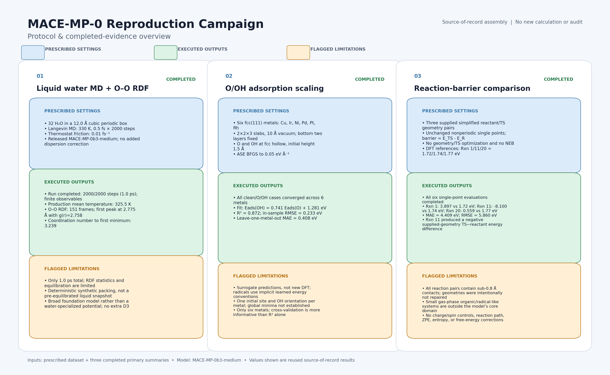
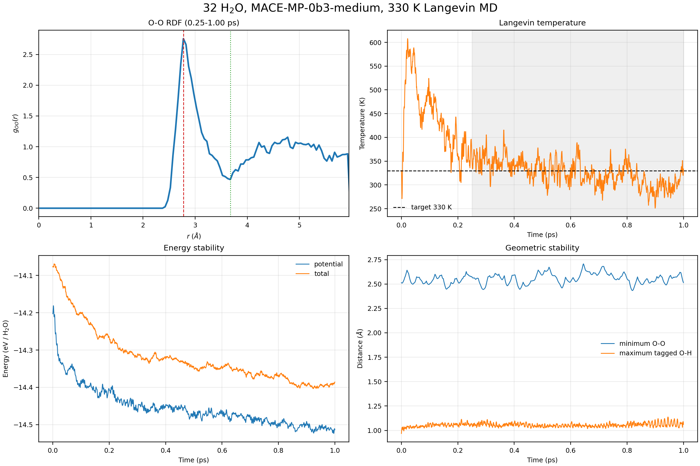
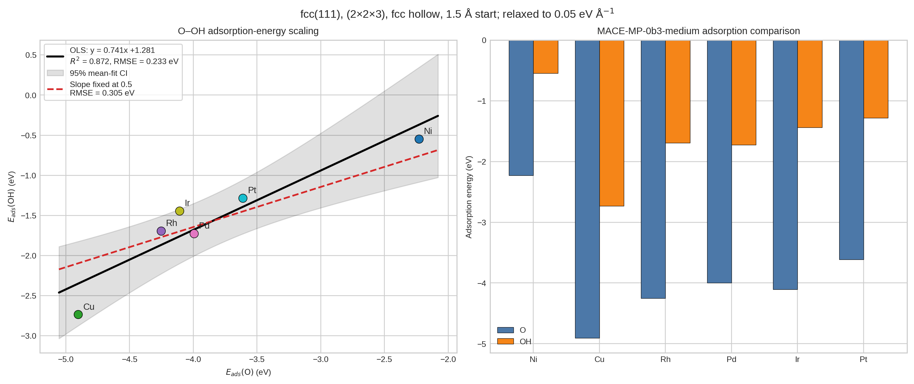
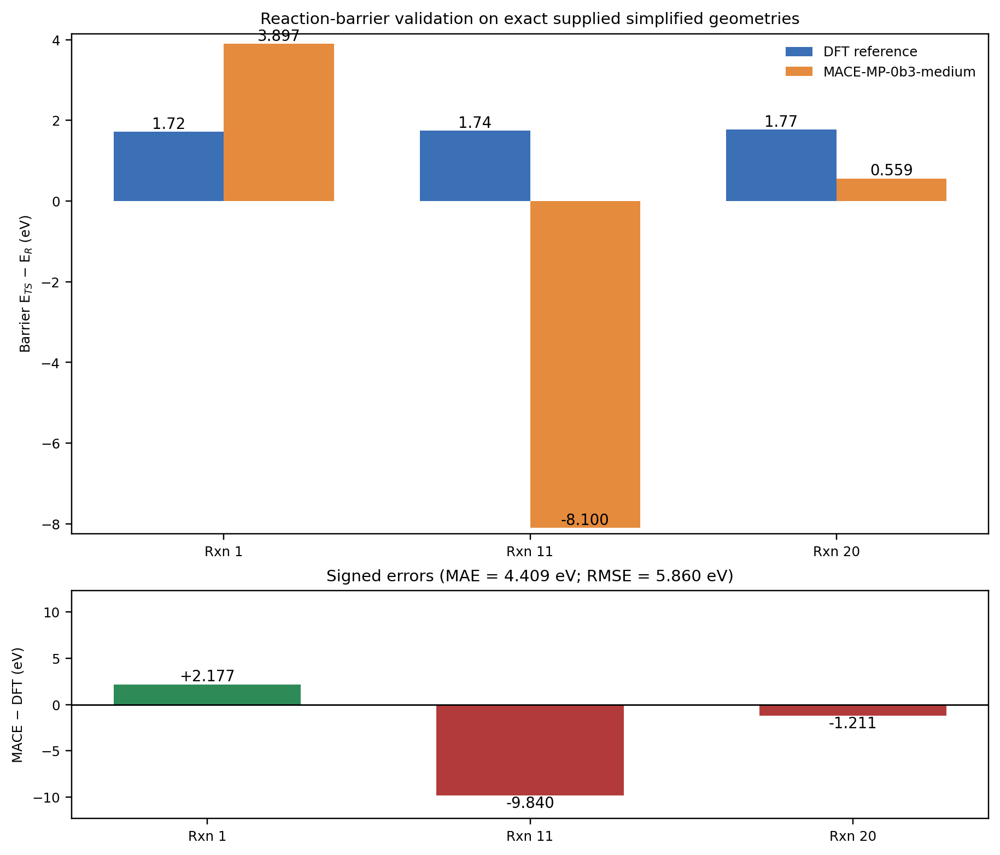

# Domain-conditional zero-shot transfer of MACE-MP-0b3-medium across water, chemisorption, and molecular reaction coordinates

## Abstract

Foundation machine-learning interatomic potentials promise broad reuse of a single atomistic model across materials and molecular environments, but their practical universality must be tested under the structural, electronic-state, and reference-energy conditions that define each task. Here we report a local reproduction and validation study of the released MACE-MP-0b3-medium potential using one compact protocol across three domains: liquid-water molecular dynamics, O/OH chemisorption on six fcc(111) metal surfaces, and exact-geometry reaction-energy differences for three supplied organic reaction pairs. The study does not train a new model or recreate the approximately 1.5-million-configuration MPtrj corpus. It evaluates the released model as supplied.

The prescribed 32-water, 12 Å cubic-cell, 330 K, 1 ps trajectory completed all 2,000 steps with finite observables and retained all tagged intramolecular O-H bonds below 1.3 Å. After discarding the first 500 steps, the mean temperature was 325.46 ± 26.57 K. The O-O radial distribution function had a first peak at 2.775 Å with g(r) = 2.758, a first minimum at 3.675 Å, and a coordination number of 3.239. The prescribed cell corresponds to only 0.554 g cm-3, and the short trajectory does not establish converged bulk-water structure. All six clean-slab/O/OH sets converged under the 0.05 eV Å-1 force threshold, corresponding to 18 optimizations. The resulting O/OH adsorption energies followed Eads(OH) = 0.7405 Eads(O) + 1.2809 eV with R2 = 0.8721 and Pearson r = 0.9339, while leave-one-out RMSE increased to 0.5171 eV and the 95% slope interval was 0.3468 to 1.1342. For the three supplied reaction coordinate pairs, the exact MACE energy differences were 3.897, -8.100, and 0.559 eV, compared with literature reference values of 1.72, 1.74, and 1.77 eV. Their MAE was 4.409 eV and RMSE was 5.860 eV. Because every pair contains sub-0.8 Å contacts and the coordinates were not verified stationary points or saddle points, these values are a negative validation result for the supplied geometries, not a general reaction-barrier benchmark.

Together, the results support a conditional form of zero-shot transfer. The released foundation potential is useful for short-time numerical stability and for identifying correlated adsorption trends under the supplied protocols. The same model does not provide universal quantitative chemistry without adequate configuration coverage, electronic-state representation, and reference-level alignment. Minimal-data fine-tuning is therefore a plausible next step, but it was not executed because no task-specific labeled set was supplied.

## 1 Introduction

Machine-learning interatomic potentials (MLIPs) are designed to approximate the potential-energy surface and its gradients at a much lower computational cost than repeated electronic-structure calculations. Their scientific value depends on more than low average errors on a training-like test set. A model used without task-specific retraining must also remain numerically stable during dynamics, preserve chemically meaningful local structure, and produce energy differences that are interpretable under the reference convention and electronic states of the target problem.

MACE addresses the representation problem with equivariant message passing and higher-body-order messages. Its message construction uses tensor products and symmetry-preserving contractions to encode many-body local environments without requiring a proportionally large number of message-passing layers [1]. The related tensor-network formulation of equivariant architectures further emphasizes that higher-order equivariant constructions can increase expressive power while retaining the rotational and permutational symmetries required for atomistic prediction [3]. These architectural properties support transferability, but they do not by themselves define the chemical domain in which a released model is quantitatively reliable.

The pretraining paradigm is equally important. The Materials Project Trajectory Dataset (MPtrj) described in the supplied literature contains 1,580,395 atom configurations drawn from broad inorganic chemical and configurational coverage, together with energies, forces, stresses, and magnetic moments [2]. Such coverage makes foundation potentials attractive for zero-shot use across many inorganic environments. It does not imply that isolated radicals, gas-phase organic reaction coordinates, water at a prescribed density, or changes in electronic reference level are equally represented. In particular, charge and magnetic-state information can be decisive for chemically distinct states that share the same elemental labels [2].

This report tests a released MACE-MP-0b3-medium model in three deliberately different regimes. The water calculation asks whether the model can propagate a small periodic liquid-water system without numerical failure and whether the trajectory retains a recognizable O-O local-structure signal. The adsorption calculation asks whether the model preserves a correlated O/OH chemisorption trend across six metals under a common surface protocol. The reaction calculation asks whether single-point energy differences between simplified supplied coordinates can reproduce literature reference barriers. These tests are not interchangeable. Numerical stability, trend transfer, and quantitative barrier accuracy require different validation criteria.

The study is a reproduction and validation study of a released model. It is not a training study, and it does not recreate a new 1.5-million-structure foundation potential because the full MPtrj corpus was not supplied. The central result is that broad zero-shot usefulness is real but domain conditional. The model succeeds most clearly when the target observable is supported by local configuration coverage and when the protocol does not require an unrepresented electronic-state or reaction-coordinate description.

## 2 Research questions and hypotheses

The study was organized around four testable questions.

1. **Numerical stability in water.** Can MACE-MP-0b3-medium complete the prescribed 32-water, 330 K, 1 ps periodic trajectory with finite observables and without breaking the tagged intramolecular O-H bonds?
2. **Trend-level chemisorption transfer.** Do the relaxed O and OH adsorption energies on six fcc(111) metal slabs follow a reproducible cross-metal scaling relation under a common geometry and convergence protocol?
3. **Quantitative reaction-energy transfer.** Do exact single-point energy differences for the three supplied reactant and transition-state-like coordinate pairs agree with the supplied literature reference barriers?
4. **Implications for adaptation.** If zero-shot performance is domain conditional, what would a scientifically meaningful minimal-data fine-tuning study need to control?

The corresponding hypotheses were deliberately domain specific. The water hypothesis predicted numerical stability and intact local molecular connectivity, but not converged liquid thermodynamics from a 1 ps trajectory. The adsorption hypothesis predicted a correlated O/OH trend, while treating absolute adsorption energies and global site ranking as protocol dependent. The reaction hypothesis was a direct quantitative test of the supplied coordinate pairs. It was expected to be informative only if the coordinates represented chemically valid reactants and transition states. The fine-tuning question was prospective: task-specific adaptation could improve transfer, but only with aligned reference energies and target-level consistency.

## 3 Data and Methods

### 3.1 Model and study design

All calculations used the released MACE-MP-0b3-medium foundation potential identified in the source records. No model parameters were trained or updated in this study. The calculations used the supplied compact dataset and protocol specification, with domain-specific quality-control checks applied after execution. The full MPtrj training corpus was not available and was not reconstructed.

The study separates three kinds of evidence:

- **Numerical stability:** finite energies, forces, temperatures, and distances; completed trajectory; preservation of tagged molecular connectivity.
- **Trend transfer:** convergence of a common set of surface calculations and statistical association across metals.
- **Quantitative benchmarking:** comparison of energy differences with external reference values only when the structures and reference definition support that comparison.

### 3.2 Executed protocols

**Table 1. Three domain-specific validation protocols.**

| Domain | System and settings | Primary observable | Domain-specific QC and interpretation |
|---|---|---|---|
| Water molecular dynamics | 32 H2O molecules, 96 atoms, periodic 12 × 12 × 12 Å3 cell, 330 K Langevin thermostat, 0.5 fs time step, 2,000 steps, total time 1.0 ps | O-O RDF, coordination, temperature, tagged O-H bond lengths | Completion with finite observables and intact tagged O-H bonds supports short-time numerical stability. The prescribed density and trajectory length are reported explicitly and are not treated as converged liquid-water properties. |
| O/OH adsorption scaling | Ni, Cu, Rh, Pd, Ir, and Pt fcc(111) slabs; 2 × 2 surface cell, 3 layers, 10 Å vacuum; fcc hollow site; initial adsorbate height 1.5 Å; bottom two layers fixed; force threshold 0.05 eV Å-1 | *E*ads(O), *E*ads(OH), ordinary least-squares scaling relation | Each metal required clean-slab, O/slab, and OH/slab optimization. Six complete sets therefore correspond to 18 optimizations. The result tests correlated trends, not global adsorption minima or DFT-level absolute energies. |
| Exact-geometry reaction differences | Rxn 1, Rxn 11, and Rxn 20 supplied reactant and transition-state-like coordinates; nonperiodic single-point energies; no optimization or NEB | Δ*E*exact = *E*TS - *E*R at the supplied coordinates | The comparison is valid only as an exact-geometry energy-difference test. The coordinates were not verified stationary points or first-order saddle points, so the values are not true transition-state barriers. |

*Figure 1. The protocol overview links the common released MACE-MP-0b3-medium model to the three domain-specific tests. The validation logic is intentionally different for numerical stability, trend-level transfer, and exact-geometry energy differences.*

### 3.3 Water molecular dynamics and RDF analysis

The water system contained 32 H2O molecules in a cubic periodic cell of side length 12 Å. The prescribed temperature was 330 K, the integration time step was 0.5 fs, and the total trajectory length was 2,000 steps, or 1.0 ps. The initial configuration was a deterministic synthetic packing rather than a pre-equilibrated liquid snapshot. The density implied by the exact molecular count and cell volume was calculated as 0.55397 g cm-3, reported here as 0.554 g cm-3.

The O-O radial distribution function was evaluated from saved frames after discarding the first 500 MD steps. With oxygen number density ρO = *N*O/*V*, the normalized RDF was computed as

$$
g_{OO}(r) = \frac{\left\langle \Delta N_{OO}(r,r+\Delta r) \right\rangle}{4\pi r^2 \Delta r\,\rho_O N_O},
$$

where the numerator is the mean number of oxygen neighbors in a spherical shell of thickness Δ*r* around all oxygen centers. The cumulative coordination number was obtained from

$$
N_c(r) = 4\pi\rho_O \int_0^r g_{OO}(r')r'^2\,dr'.
$$

The RDF used 151 saved frames, a bin width of 0.05 Å, and a maximum radius of 5.95 Å. Temperature statistics were calculated over steps 500 through 2,000. Tagged intramolecular O-H bonds were tracked throughout the saved trajectory.

### 3.4 Adsorption energies and scaling analysis

For each of six fcc(111) metal slabs, the clean slab, O-covered slab, and OH-covered slab were optimized with the bottom two layers fixed. The same 0.05 eV Å-1 maximum-force convergence threshold was used for all geometries. The gas-phase O and OH references were placed in isolated 10 Å boxes. One initial fcc hollow site and one OH orientation were used for each metal. Clean slabs were relaxed separately under the same fixed-layer rule before calculating adsorption energies.

The adsorption energy of adsorbate X was defined as

$$
E_{\mathrm{ads}}(X) = E_{X/\mathrm{slab}}^{\mathrm{relaxed}} - E_{\mathrm{slab}}^{\mathrm{relaxed}} - E_X^{\mathrm{isolated, relaxed}}.
$$

Negative values therefore indicate exothermic binding under the adopted reference convention. The O/OH scaling relation was fitted by ordinary least squares,

$$
y_i = \beta_1 x_i + \beta_0 + \epsilon_i,
$$

with *x**i* = *E*ads(O) and *y**i* = *E*ads(OH). The fitted coefficients were obtained from

$$
\hat{\beta}_1 = \frac{\sum_i (x_i-\bar{x})(y_i-\bar{y})}{\sum_i (x_i-\bar{x})^2},
\qquad
\hat{\beta}_0 = \bar{y} - \hat{\beta}_1\bar{x}.
$$

The analysis reports R2, Pearson correlation, in-sample RMSE, 95% confidence intervals, and leave-one-metal-out errors. These diagnostics are important because the fit contains only six metals.

### 3.5 Exact-geometry reaction-energy differences

The reaction test used three supplied coordinate pairs: cyclobutene ring opening (Rxn 1), methoxy decomposition (Rxn 11), and cyclopropane ring opening (Rxn 20). Each reactant and transition-state-like structure was evaluated at its supplied coordinates with a single-point MACE energy. No structural optimization, transition-state search, nudged elastic band calculation, zero-point correction, entropy correction, or finite-temperature free-energy calculation was performed.

The computed quantity was the exact-geometry difference

$$
\Delta E_{\mathrm{exact}}^{\mathrm{MACE}} = E_{\mathrm{MACE}}(R_{\mathrm{TS}}^{\mathrm{supplied}}) - E_{\mathrm{MACE}}(R_{\mathrm{R}}^{\mathrm{supplied}}).
$$

This expression is not a transition-state barrier unless *R*R is a valid reactant stationary point and *R*TS is a verified first-order saddle point on the same potential-energy surface. The supplied literature values of 1.72, 1.74, and 1.77 eV were used as reference barriers only. No new DFT calculations were executed.

### 3.6 Claim calibration

The protocol was designed to distinguish three outcomes rather than collapse them into one universal score. A completed and finite trajectory supports numerical stability. A reproducible O/OH relation across six converged surfaces supports a trend-level transfer claim. A comparison to reaction barriers requires chemically valid stationary-point geometries and compatible electronic-state and reference definitions. The latter conditions were not satisfied by the supplied reaction coordinates, so the reaction result is interpreted as a failure of the supplied exact-geometry validation, not as a general benchmark of MACE reaction chemistry.

## 4 Results

### 4.1 Protocol execution and overall validation pattern

All three protocol branches completed with the released model. The resulting evidence is asymmetric by design. The water branch supports short-time numerical stability and a local structural signal. The adsorption branch supports a correlated cross-metal trend with substantial small-sample uncertainty. The reaction branch exposes a severe out-of-domain and geometry-validity failure for the supplied coordinate pairs. This pattern is the main result of the study: zero-shot usefulness is observable, but the valid claim depends on the observable and the target configuration.

### 4.2 Water dynamics: stable propagation with unconverged liquid statistics

The 32-water trajectory completed all 2,000 prescribed steps, corresponding to 1.0 ps, and all recorded observables remained finite. The post-discard temperature mean was 325.46 ± 26.57 K. The maximum tracked intramolecular O-H bond length was 1.138 Å, and no tagged O-H bond exceeded 1.3 Å. These results support stable short-time propagation under the stated protocol and show that the model did not immediately dissociate the tagged water molecules.

*Figure 2. The trajectory completed without numerical failure, while the post-discard O-O RDF showed a first peak at 2.775 Å and a first minimum at 3.675 Å. Temperature fluctuations and the short observation window are shown as part of the stability assessment, not as evidence of converged liquid-water thermodynamics.*

The O-O RDF first peak occurred at 2.775 Å with g(r) = 2.758. The first post-peak minimum was at 3.675 Å, where the cumulative coordination number was 3.239. These values provide a recognizable first-shell structural signature under the supplied model and cell. They do not establish that the model reproduces experimental liquid-water structure because the exact 32-water, 12 Å cell has a density of only 0.554 g cm-3, the initial packing was synthetic, and the production interval after discard was only 0.75 ps. The water result is therefore best described as stable short-time dynamics with an interpretable local RDF, not a converged bulk-liquid validation.

The temperature standard deviation also matters for interpretation. The mean is close to the nominal 330 K target, but the 26.57 K spread reflects the small system, thermostat-driven dynamics, and early structural relaxation. The total trajectory length is too short to support claims about long-time diffusion, equilibrium density, hydrogen-bond lifetimes, or converged thermodynamic averages.

### 4.3 Adsorption scaling: converged geometry sets and correlated O/OH trends

All six clean-slab/O/OH sets converged at the specified 0.05 eV Å-1 threshold. Because each metal required one clean-slab relaxation, one O/slab relaxation, and one OH/slab relaxation, the result corresponds to 18 completed optimizations, not six total optimizations. The relaxed adsorbates retained the intended fcc site within the reported lateral-shift tolerance.

**Table 2. MACE-MP-0b3-medium adsorption energies for six fcc(111) metals.**

| Metal | Lattice constant (Å) | *E*ads(O) (eV) | *E*ads(OH) (eV) | Clean/O/OH converged | O final *f*max (eV Å-1) | OH final *f*max (eV Å-1) |
|---|---:|---:|---:|:---:|---:|---:|
| Ni | 3.52 | -2.2297 | -0.5457 | Yes | 0.0340 | 0.0189 |
| Cu | 3.61 | -4.9045 | -2.7345 | Yes | 0.0450 | 0.0229 |
| Rh | 3.80 | -4.2539 | -1.6924 | Yes | 0.0449 | 0.0438 |
| Pd | 3.89 | -3.9948 | -1.7242 | Yes | 0.0424 | 0.0124 |
| Ir | 3.84 | -4.1074 | -1.4419 | Yes | 0.0364 | 0.0161 |
| Pt | 3.92 | -3.6110 | -1.2823 | Yes | 0.0425 | 0.0385 |

*Figure 3. O and OH adsorption energies are correlated across Ni, Cu, Rh, Pd, Ir, and Pt under one common fcc(111) protocol. The fitted relation is a trend-level result from six metals, with uncertainty quantified by confidence intervals and leave-one-metal-out errors.*

The ordinary least-squares relation was

$$
E_{\mathrm{ads}}(\mathrm{OH}) = 0.7405\,E_{\mathrm{ads}}(\mathrm{O}) + 1.2809\ \mathrm{eV},
$$

with R2 = 0.8721, Pearson r = 0.9339, in-sample MAE = 0.2020 eV, and in-sample RMSE = 0.2328 eV. The slope 95% confidence interval was 0.3468 to 1.1342 eV per eV, and the intercept 95% confidence interval was -0.2688 to 2.8306 eV. Leave-one-out RMSE increased to 0.5171 eV, with leave-one-out slope estimates ranging from 0.5615 to 1.1225.

The fit therefore supports a correlated O/OH chemisorption trend under the supplied six-metal protocol. It does not establish accurate absolute adsorption energies relative to DFT, global adsorption minima, or transfer to other surface orientations and adsorbate configurations. The isolated O and OH references also involve radical-like electronic states for which the model has no explicit charge or spin/multiplicity input. The scaling relation is consequently the scientifically strongest interpretation of this branch.

### 4.4 Reaction validation: failure for the supplied simplified coordinate pairs

The reaction calculations evaluated six single-point structures, two for each of three reactions. The exact MACE energy differences were compared with the supplied literature reference barriers, while preserving the supplied coordinates without repair or optimization.

**Table 3. Exact-geometry reaction-energy differences and supplied literature reference barriers.**

| Reaction | Formula | Closest supplied contact (Å) | MACE exact Δ*E* (eV) | Literature reference (eV) | Signed error (eV) |
|---|---|---:|---:|---:|---:|
| Rxn 1, cyclobutene ring opening | C4H4 | 0.707, C-H | 3.897 | 1.72 | 2.177 |
| Rxn 11, methoxy decomposition | CH3O | 0.583, O-H in reactant | -8.100 | 1.74 | -9.840 |
| Rxn 20, cyclopropane ring opening | C3H6 | 0.700, C-H | 0.559 | 1.77 | -1.211 |

*Figure 4. The three exact-geometry energy differences do not reproduce the supplied literature reference barriers. The comparison is diagnostic for the supplied coordinates and model conditions, not a transition-state benchmark because the structures were not verified stationary points or saddle points.*

Across the three pairs, the MAE was 4.409 eV and the RMSE was 5.860 eV. Rxn 11 produced a negative exact-geometry difference of -8.100 eV, despite a positive literature reference value of 1.74 eV. Every supplied reaction pair contained at least one interatomic contact below 0.8 Å, and the Rxn 11 reactant contained a 0.583 Å O-H contact. The coordinate pairs therefore carry severe geometry-domain warnings. The CH3O case is additionally sensitive to radical electronic-state treatment because the calculation had no explicit total-charge or spin-multiplicity control.

This branch is a negative validation result for the supplied simplified geometries. It should not be reported as evidence that the released model has a general reaction-barrier MAE of 4.409 eV, nor should the three exact differences be called true transition-state barriers. The result instead identifies the conditions under which a direct zero-shot quantitative comparison is scientifically invalid.

## 5 Discussion

### 5.1 The supported claim is conditional zero-shot usefulness

The three-domain results do not support a universal score for MACE-MP-0b3-medium. They support a more useful conclusion: a released foundation potential can provide meaningful zero-shot information across domains when the target observable remains within the model's effective configuration and state coverage, but the same model can fail sharply when the protocol combines invalid geometries, unrepresented electronic states, and a different chemical regime.

The architecture helps explain why transfer is possible. Higher-body-order equivariant messages encode local directional and many-body information efficiently, while the broad pretraining paradigm supplies elemental and configurational diversity [1,2]. The architecture and pretraining together provide a strong prior over local atomistic environments. Neither component guarantees universal chemistry. A learned energy surface remains conditional on the data distribution, reference convention, and state variables represented during training.

### 5.2 Water: stability is a useful but limited zero-shot result

The water trajectory establishes a practical capability that is distinct from thermodynamic accuracy. The model propagated 96 atoms for 1 ps without nonfinite observables or tagged O-H bond rupture, and the O-O RDF developed a first-shell peak and minimum that can be quantified. This is meaningful evidence of short-time numerical stability under the prescribed protocol.

The same calculation does not establish an accurate liquid-water equation of state or converged structure. The cell density is 0.554 g cm-3, far below ambient liquid-water density, and the initial configuration was a synthetic packing. A short trajectory from that starting point cannot determine whether the observed RDF is an equilibrium property. The correct conclusion is therefore protocol specific: MACE-MP-0b3-medium can sustain a stable short-time water trajectory with a measurable local structural signal under the supplied cell, while longer and better-equilibrated simulations would be required for quantitative liquid-water validation.

### 5.3 Adsorption: correlated chemisorption trends are more defensible than absolute energies

The adsorption branch gives the clearest quantitative evidence of cross-domain transfer. All 18 optimizations converged, and the O/OH energies across six metals showed a strong in-sample association. The scaling relation is useful because it asks whether the model preserves a chemically meaningful ordering and coupling across a controlled family of surfaces. It does not require the stronger claim that each isolated radical reference, surface energy, and adsorbate state is quantitatively correct on an absolute DFT scale.

The uncertainty diagnostics prevent overinterpretation. Six metals are insufficient for a stable universal scaling law, and the leave-one-out RMSE is more than twice the in-sample RMSE. The slope interval also spans a broad range. In addition, only one site and one OH orientation were sampled per metal, and no explicit spin or charge state was supplied for the isolated O and OH references. The result is best used as a trend-level screening signal, followed by task-specific validation before quantitative catalyst ranking.

### 5.4 Reaction failure identifies a coverage boundary

The reaction branch is informative precisely because it fails. The exact-geometry differences do not agree with the supplied literature values, and the failure includes a negative predicted difference for Rxn 11. The supplied coordinate pairs contain compressed contacts below 0.8 Å, including a 0.583 Å O-H contact, and they were not verified as stationary reactants or saddle points. The test therefore combines a geometric validity problem with a domain problem. The model was released from a foundation-potential paradigm dominated by inorganic periodic configurations, whereas the supplied structures are small gas-phase organic or radical-like species with no explicit charge or multiplicity input.

The result does not justify a broad statement that MACE-MP-0b3-medium cannot model reactions. It justifies a narrower and more actionable statement: exact single-point differences on unverified simplified reaction geometries are not a valid quantitative reaction-barrier benchmark for this released model. A meaningful reaction study would require chemically valid reactants, products, and transition states, consistent state definitions, and a reference calculation at the target level of theory.

### 5.5 Fine-tuning implications

Minimal-data fine-tuning remains scientifically plausible, but it is a proposed next step rather than an executed result. The supplied transfer-learning literature shows why the target data cannot simply be appended to a foundation model without checking energy references. Cross-functional total-energy shifts can be large, and refitting elemental reference energies before fine-tuning can improve correlation and training stability [4]. When source and target labels are poorly correlated, transfer learning can provide little benefit or produce negative transfer [4].

For the present domains, a useful fine-tuning set would need to be matched to the intended scientific claim. Water adaptation should sample the target density, temperature range, hydrogen-bond configurations, and relevant dissociation or proton-transfer environments. Adsorption adaptation should include the intended surface facets, sites, coverages, adsorbate orientations, and consistent treatment of isolated reference states. Reaction adaptation should contain validated stationary points and nearby path configurations, with explicit treatment of charge and spin when required. Reference-level alignment should be established before judging data efficiency.

## 6 Limitations and recommended next work

The limitations are specific to the claims supported by this report.

1. **Water sampling and density.** The 1 ps trajectory is too short for converged RDF, diffusion, hydrogen-bond, or thermodynamic statistics. The prescribed 12 Å cell with 32 molecules gives 0.554 g cm-3, so the result is not an ambient-density water validation. Recommended next work is a longer, independently seeded ensemble at physically selected densities, with equilibration and block-averaged uncertainty estimates.
2. **Adsorption coverage.** One fcc site and one initial OH orientation were sampled for each metal. The converged geometries establish protocol completion, not global minima or coverage-dependent energetics. Recommended next work is to expand sites, orientations, coverages, and surface facets, then compare the trend and absolute energies with a consistent reference level.
3. **Electronic-state representation.** The released model does not expose explicit total charge or spin multiplicity in these calculations. This is especially relevant to isolated O and OH references and the CH3O reaction pair. Recommended next work is to use a model and reference protocol that encode the required electronic states or to fine-tune on state-consistent labeled data.
4. **Reaction coordinate validity.** The supplied reaction coordinates contain sub-0.8 Å contacts and were not verified stationary points or saddle points. Recommended next work is to construct chemically valid reactant, product, and transition-state structures, validate them with a target electronic-structure method, and sample the reaction path rather than comparing two arbitrary coordinate snapshots.
5. **Training scope.** The full MPtrj corpus was not supplied, and no new foundation-model training was performed. The present report therefore evaluates a released model and cannot attribute the observed behavior to a newly trained model or reproduce the original pretraining process.
6. **Reference-level consistency.** The reaction reference barriers are literature values supplied with the dataset. No new DFT calculations were executed. Any future quantitative comparison must specify the reference method, electronic state, geometry definition, and energy convention.

The optional cuEquivariance acceleration was unavailable in the executed environment. This is a performance-only deviation and does not change the scientific settings or the interpretation of the reported energies and trajectories.

## 7 Conclusions

A single released MACE-MP-0b3-medium foundation potential showed meaningful but conditional cross-domain zero-shot usefulness. Under the prescribed water protocol, it completed a 1 ps trajectory with finite observables, retained tagged O-H bonds, and produced a measurable O-O RDF first-shell signal. Under the prescribed adsorption protocol, all 18 clean-slab/O/OH optimizations converged and the six-metal data followed a correlated O/OH scaling relation. Under the supplied reaction protocol, exact single-point differences failed to reproduce the literature reference barriers, and the coordinate-quality warnings make that comparison invalid as a general transition-state benchmark.

The practical conclusion is not universal performance, but domain-specific interpretability. MACE higher-body-order equivariant representations and broad inorganic pretraining create a transferable local prior. Reliable zero-shot chemistry still depends on configuration coverage, electronic-state treatment, and reference-level consistency. Minimal-data fine-tuning is a reasonable next step when those conditions can be supplied, but it must use aligned labels and target-relevant configurations to avoid negative transfer.

## Scientific Reasonableness Check

**Table 4. Claim and provenance checks applied to the reported results.**

| Check | Evidence | Scientific interpretation |
|---|---|---|
| Model identity | Released MACE-MP-0b3-medium used in all three branches | The report evaluates one released foundation potential. It does not report new model training. |
| Water execution | 2,000 of 2,000 steps completed; all observables finite | Supports numerical stability for the stated 1 ps protocol. |
| Water physical scope | Density 0.554 g cm-3; 1 ps total trajectory; synthetic initial packing | RDF and temperature statistics are not treated as converged bulk-water properties. |
| Molecular integrity | Maximum tracked O-H bond 1.138 Å; no tagged bond above 1.3 Å | Supports retention of tagged water connectivity during the short run. |
| Adsorption convergence | Six clean-slab/O/OH sets, 18 optimizations, all converged at 0.05 eV Å-1 | Supports numerical convergence of the prescribed geometry sets. |
| Adsorption statistics | R2 = 0.8721; Pearson r = 0.9339; LOOCV RMSE = 0.5171 eV; slope 95% CI = 0.3468 to 1.1342 | Supports a correlated trend with small-sample and leverage sensitivity. |
| Reaction geometry | All three pairs contain sub-0.8 Å contacts; Rxn 11 has a 0.583 Å O-H contact | The supplied structures are not suitable evidence for general barrier accuracy. |
| Reaction calculation | Six single-point energies; no optimization, NEB, or new DFT | Values are exact-geometry MACE differences compared with literature references only. |
| Training provenance | Full MPtrj corpus not supplied; no task-specific labels supplied | Fine-tuning and foundation-model retraining are not executed results. |

## Reproducibility and Data/Code Availability

The numerical results in this report are traceable to the following source-of-record artifacts:

- `data/MACE-MP-0_Reproduction_Dataset.txt`, containing the prescribed water, adsorption, and reaction inputs and the supplied literature reference barriers.
- `outputs/mace_mp0_protocol_overview.json`, containing the completed three-domain protocol summary and claim-relevant quality-control notes.
- `outputs/water_mace_mp0b3/water_mace_mp0b3_summary.json`, containing the water run configuration, stability statistics, RDF summary, and artifact paths.
- `outputs/water_mace_mp0b3/water_mace_mp0b3_qc.json`, containing specification checks, density, bond-length checks, and trajectory-level quality-control values.
- `outputs/water_mace_mp0b3/water_mace_mp0b3_oo_rdf.csv`, containing the O-O RDF and cumulative coordination data.
- `outputs/water_mace_mp0b3/water_mace_mp0b3_thermo.csv`, containing the trajectory thermodynamic and distance observables.
- `outputs/mace_mp0_adsorption_scaling/adsorption_summary.json`, containing the six-metal energies, convergence data, scaling statistics, and scientific limitations.
- `outputs/mace_mp0_adsorption_scaling/adsorption_energies.csv`, containing the machine-readable six-metal adsorption table.
- `outputs/reaction_barrier_validation/mace_mp_0b3_reaction_barrier_summary.json`, containing exact-geometry reaction differences, literature reference values, contact checks, and aggregate statistics.
- `outputs/reaction_barrier_validation/mace_mp_0b3_reaction_barriers.csv`, containing the machine-readable reaction comparison table.
- `report/images/mace_mp0_protocol_data_overview.png`.
- `report/images/water_mace_mp0b3_rdf_md_stability.png`.
- `report/images/mace_mp0_O_OH_adsorption_scaling.png`.
- `report/images/mace_mp_0b3_reaction_barrier_validation.png`.

The model identity used in the source records is `MACE-MP-0b3-medium.model`, a released model artifact. The full MPtrj corpus, a new 1.5-million-structure training run, and a task-specific fine-tuning dataset are not part of this study. No new DFT calculations were executed. The supplied DFT barrier values are treated as literature reference values only.

## References

1. Batatia, I., Kovács, D. P., Simm, G. N. C., Ortner, C. & Csányi, G. *MACE: Higher Order Equivariant Message Passing Neural Networks for Fast and Accurate Force Fields*. Advances in Neural Information Processing Systems 35, NeurIPS 2022. arXiv:2206.07697. The supplied PDF identifies the NeurIPS 2022 publication and arXiv record; no DOI is shown in the supplied evidence.
2. Deng, B., Zhong, P., Jun, K., Riebesell, J., Han, K., Bartel, C. J. & Ceder, G. CHGNet as a pretrained universal neural network potential for charge-informed atomistic modelling. *Nature Machine Intelligence* **5**, 1031-1041 (2023). doi:10.1038/s42256-023-00716-3.
3. Li, Z., Pengmei, Z., Zheng, H., Thiede, E., Liu, J. & Kondor, R. Unifying O(3) equivariant neural networks design with tensor-network formalism. *Machine Learning: Science and Technology* **5**, 025044 (2024). doi:10.1088/2632-2153/ad4a04.
4. Huang, X., Deng, B., Zhong, P., Kaplan, A. D., Persson, K. A. & Ceder, G. Cross-functional transferability in foundation machine learning interatomic potentials. *npj Computational Materials* **11**, 313 (2025). doi:10.1038/s41524-025-01796-y.
