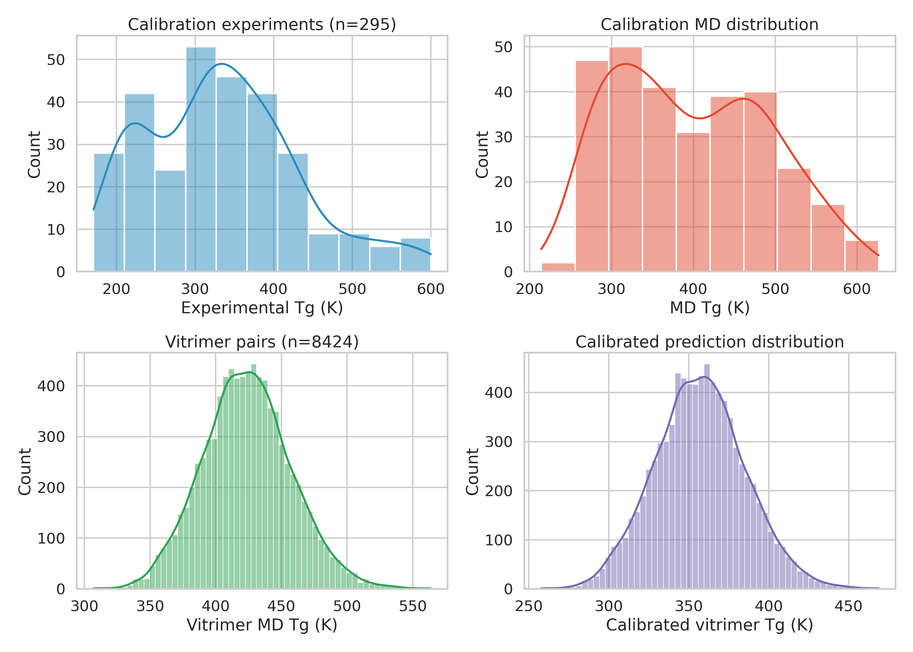
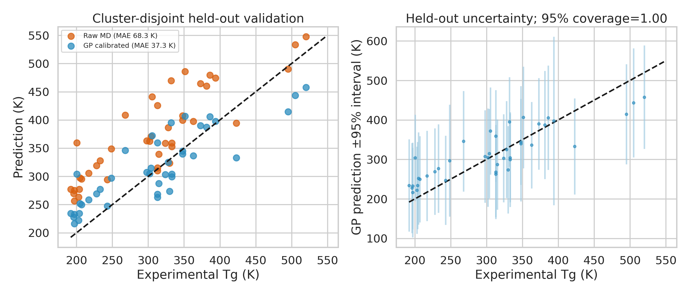
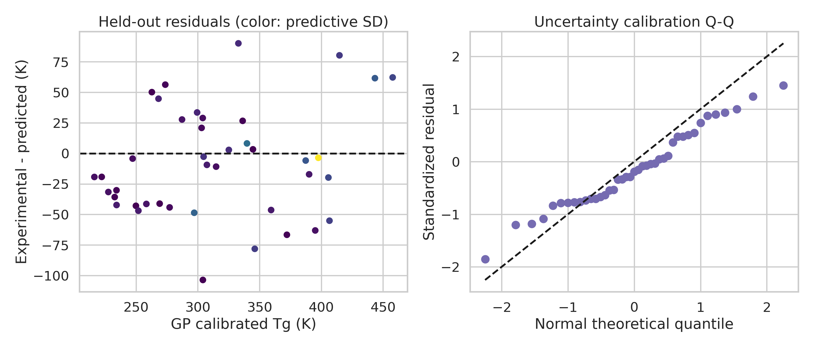
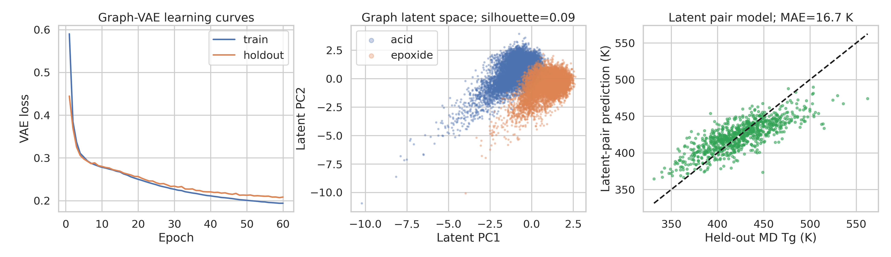
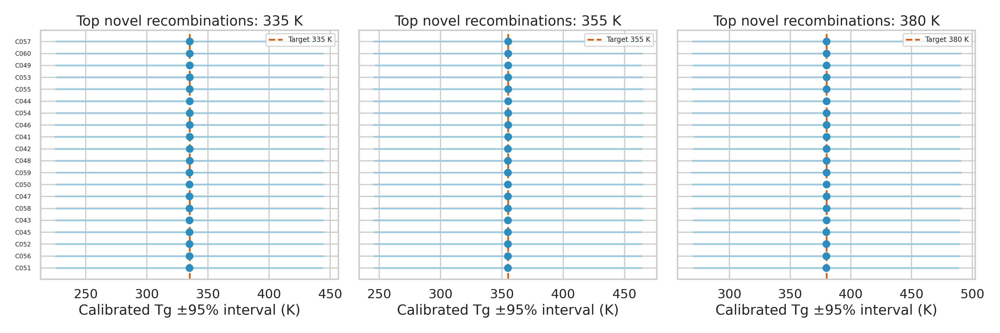

<h1 align="center">Gaussian-process calibrated screening of acid-epoxide precursor recombinations for vitrimer design</h1>

## Abstract

Glass-transition temperature (`Tg`) is an important design variable for vitrimer formulations, but molecular dynamics (MD) estimates can carry systematic bias, and a predicted `Tg` does not by itself establish network formation or recyclability. Here, an uncertainty-aware computational pipeline integrates MD-to-experiment Gaussian-process (GP) calibration, a graph variational representation of acid and epoxide precursors, a precursor-disjoint pair model, and chemistry-constrained screening of previously unobserved acid-epoxide recombinations. Across 295 polymers, raw MD `Tg` overpredicts experiment by 63.85 K on average and has a mean absolute error (MAE) of 70.61 K. On a chemistry-cluster-disjoint holdout of 41 polymers, GP calibration reduces MAE to 37.26 K, root mean squared error (RMSE) to 44.94 K, and bias to 8.10 K, with `R2 = 0.725` and 95% predictive-interval coverage of 1.00. Applying the calibrated model to 8,424 vitrimer pair records gives a predictive-mean distribution from 257.86 to 468.62 K, with a median of 356.91 K. The graph variational representation trained on 15,396 unique precursors reconstructs held-out fingerprints with Jaccard similarity 0.702, standardized descriptor RMSE 0.113, and precursor-role accuracy 1.000. A pair model evaluated on 862 acid-epoxide pairs held out by connected components reaches MAE 16.70 K, RMSE 21.21 K, `R2 = 0.590`, and 95% coverage of 0.956. Screening 58,487 valid, previously unobserved recombinations produces 60 ranked candidates at 335, 355, and 380 K. Their central predictions closely match the selected targets, but calibrated uncertainties remain approximately 55 to 57 K, so the results define computational leads rather than precise property guarantees. All candidate structures are recombinations of known input precursors. Zero genuinely de novo structures and zero experimental measurements were produced. Experimental testing is required to determine cure conversion, permanent-network formation, exchange kinetics, topology freezing, reprocessability, and recyclability.

**Keywords:** vitrimers; acid-epoxide networks; glass-transition temperature; Gaussian-process calibration; graph variational representation; uncertainty quantification; inverse design; molecular recombination

## 1. Introduction and related work

Vitrimers are permanently crosslinked polymer networks that can undergo associative bond exchange. In acid-epoxide systems, transesterification can rearrange network topology while preserving network connectivity under suitable catalytic and thermal conditions [1]. This combination of network integrity and exchangeable topology creates a route to thermosets that can relax stress, flow during processing, and be reshaped without behaving as ordinary thermoplastics. The relevant material window depends on more than a single thermal descriptor. Cure conversion, crosslink functionality, catalyst loading, exchange kinetics, segmental mobility, creep, and the relationship between the glass transition and topology-freezing behavior all affect practical performance [1,2].

`Tg` remains a useful first screening variable because it constrains segmental mobility and helps define a service or processing window. It is not, however, a sufficient vitrimer descriptor. A high predicted `Tg` does not establish that an acid and an epoxide will cure into a permanent network, that transesterification will be fast enough for reprocessing, or that the network will retain mechanical integrity during repeated cycles [1,2]. A useful computational design workflow therefore needs both a reliable property estimate and explicit chemical constraints on the proposed formulation space.

Continuous molecular representations provide one route to property-guided search. Gómez-Bombarelli et al. showed that a variational autoencoder (VAE) can map discrete molecular structures into a continuous latent space and that a Gaussian-process surrogate can guide optimization in that space [3]. Batra et al. extended the VAE plus Gaussian-process framework to polymer design, including a polymer-specific representation and `Tg` prediction [4]. These studies establish precedents for latent representations and surrogate-guided molecular or polymer search, but they do not model acid-epoxide crosslinked formulations, dynamic exchange, catalyst-dependent kinetics, or recycling behavior. The supplied literature also does not demonstrate GP calibration of MD `Tg` values or graph-based representation learning for vitrimer precursor pairs.

This work addresses a narrower and more defensible problem. It integrates an MD-to-experiment calibration layer with a graph variational precursor representation and a pair model that predicts `Tg` for acid-epoxide combinations under a precursor-disjoint evaluation. A chemistry-constrained screening stage then searches recombinations of known acids and epoxides that were not observed as pairs in the supplied data. The central capability is uncertainty-aware, target-directed recombination screening. It is not universal property prediction, de novo molecular generation, or experimental validation.

## 2. Research hypothesis and objectives

The working hypothesis was that a GP calibration layer can remove the dominant systematic bias in the supplied MD `Tg` values while retaining useful predictive uncertainty, and that a precursor representation learned from molecular graphs can support pair-level prediction for acid-epoxide recombinations that are not present in the labeled pair data.

The study had four objectives:

1. Quantify the bias and error of raw MD `Tg` values and test GP calibration on a Morgan-fingerprint chemistry-cluster-disjoint holdout.
2. Learn a reusable variational representation for acid and epoxide precursor graphs and evaluate it through held-out reconstruction and role prediction.
3. Predict pair-level MD `Tg` values with a model evaluated on acid-epoxide connected-component-disjoint pairs, while retaining uncertainty from both model disagreement and reported MD variability.
4. Screen chemically compatible, previously unobserved acid-epoxide recombinations toward distribution-derived target values of 335, 355, and 380 K, with explicit treatment of uncertainty and pair-space distance.

## 3. Data overview

The calibration data contain 295 polymers with experimental `Tg`, MD `Tg`, and reported MD standard deviations. The vitrimer data contain 8,424 acid-epoxide pair records with MD `Tg` and reported standard deviations. Input quality control found no missing values, no duplicate calibration SMILES, and no duplicate vitrimer pairs. The precursor set contains 15,396 unique molecular structures. All precursors passed the recorded sanitization and functionality checks, with zero invalid precursors, zero acid-role functionality failures, and zero epoxide-role functionality failures (`outputs/input_qc_summary.json`).

The data support two different validation questions. The GP calibration holdout tests transfer across chemistry clusters among the 295 polymer calibration records. The pair-model holdout tests transfer across connected components of the acid-epoxide bipartite pair graph, with no precursor identity shared between train, validation, and test partitions. These splits are not interchangeable. The first evaluates MD-to-experiment calibration across separated polymer chemistries. The second evaluates pair prediction when the precursor identities themselves are held out from supervised fitting.



*Figure 1. Data overview. The four panels show the experimental and MD `Tg` distributions in the 295-polymer calibration set, the raw MD `Tg` distribution for 8,424 vitrimer pairs, and the calibrated predictive-mean distribution for those vitrimer pairs. The calibrated distribution is used to define screening targets, while the uncertainty associated with each prediction is retained separately.*

### Compact results table

| Module | Evaluation set | Size | Primary result |
|---|---:|---:|---|
| Raw MD `Tg` | All calibration polymers | 295 | Bias `+63.85 K`; MAE `70.61 K`; RMSE `84.55 K` |
| GP calibration | Chemistry-cluster-disjoint holdout | 41 | MAE `37.26 K`; RMSE `44.94 K`; bias `+8.10 K`; `R2 = 0.725`; 95% coverage `1.00` |
| Calibrated vitrimer distribution | All vitrimer pair records | 8,424 | Predictive means `257.86 to 468.62 K`; median `356.91 K` |
| Graph variational representation | Held-out precursor structures | 1,540 | Fingerprint Jaccard `0.702`; descriptor RMSE `0.113`; role accuracy `1.000` |
| Precursor-disjoint pair model | Connected-component-disjoint test pairs | 862 | MAE `16.70 K`; RMSE `21.21 K`; `R2 = 0.590`; 95% coverage `0.956` |
| Recombination screening | Valid, previously unobserved pairs | 58,487 screened; 60 shortlisted | Targets `335`, `355`, and `380 K`; candidate calibrated SD approximately `55 to 57 K` |

## 4. Methodology

### 4.1 Data quality control and molecular role assignment

The implementation reads the calibration and vitrimer pair data, canonicalizes molecular SMILES with RDKit, and sanitizes each precursor structure. The acid role requires exactly two carboxylic-acid groups, no epoxide ring, and no free primary or secondary amine that could compete with epoxy cure. The epoxide role requires exactly two epoxide rings, no carboxylic-acid group, and no such free amine. The screening stage also enforces 2:2 functional stoichiometry at the precursor-pair level. These rules define chemical compatibility for the computational screen. They do not establish that a selected formulation will cure successfully.

For molecular descriptors, each structure is represented by molecular weight, calculated logP, topological polar surface area, ring count, hydrogen-bond donor count, hydrogen-bond acceptor count, fraction of sp3 carbon, and heavy-atom count. Morgan fingerprints use radius 2. The 256-bit fingerprint is reconstructed by the graph variational model. A 1,024-bit Morgan fingerprint is used for the Taylor-Butina clustering that defines the calibration split. The detailed precursor quality-control table is available in `outputs/precursor_structure_qc.csv`.

### 4.2 Gaussian-process calibration of MD `Tg`

The calibration layer maps the raw MD estimate, `tg_md`, to the experimental value, `tg_exp`. The model uses standardized input and output variables and a GP with a `ConstantKernel * RBF + WhiteKernel` covariance structure. The implementation fits the GP with a small numerical `alpha` of `1e-6` and eight optimizer restarts. The reported MD standard deviation is treated as uncertainty in the input MD estimate, not as an experimental-output noise term. For each prediction, Monte Carlo samples are drawn from the reported MD mean and standard deviation, passed through the GP, and combined with the GP posterior uncertainty and learned residual scatter. The same MD standard deviation is not also inserted as an output `alpha` term, which avoids double counting.

The calibration split uses 1,024-bit Morgan fingerprints, Taylor-Butina clustering with a distance cutoff of 0.55, and an 80:20 cluster-disjoint partition. It contains 254 training polymers and 41 held-out polymers across 77 clusters. The holdout predictions and split assignments are stored in `outputs/calibration_holdout_predictions.csv` and `outputs/calibration_split_assignments.csv`. The fitted holdout kernel is reported as `4.37^2 * RBF(length_scale=8.25) + WhiteKernel(noise_level=0.327)` in `outputs/calibration_metrics.json`.

The holdout uncertainty uses 384 Monte Carlo samples per input record. The final GP is then fit to all 295 calibration polymers and propagated to the 8,424 vitrimer MD predictions. The calibrated mean and 95% interval for each vitrimer pair are recorded in `outputs/vitrimer_calibrated_predictions.csv`.

### 4.3 Graph variational precursor representation

Each unique precursor is converted to a molecular graph with atom features and bond-type-specific edges. The encoder contains four message-passing layers, with separate learned transformations for single, double, triple, and aromatic bonds. Mean pooling converts node states into a graph-level representation. The encoder outputs a 24-dimensional Gaussian posterior with a KL regularization term.

The variational representation uses multiple reconstruction heads for a 256-bit Morgan fingerprint, atom and bond histograms, the eight standardized molecular descriptors, and the precursor role. The decoder is a representation decoder, not an atom-by-atom graph decoder. It does not output a molecular graph with explicit atom and bond connectivity, and the pipeline makes no claim of de novo molecular generation. This distinction is important because chemically valid structures in the candidate screen come from known input precursors and explicit compatibility filtering, not from decoding new molecular graphs.

The graph model uses a stratified 90:10 precursor holdout by role. Training uses AdamW with the settings recorded in the implementation, a 24-dimensional latent posterior, mini-batches, KL annealing, gradient clipping, and early selection by holdout loss. The best recorded epoch is 59. Reconstruction predictions are available in `outputs/graph_vae_holdout_reconstruction.csv`, and the training history is available in `outputs/graph_vae_training_history.csv`.

### 4.4 Precursor-disjoint acid-epoxide pair prediction

Pair features concatenate the acid latent vector, epoxide latent vector, their element-wise absolute difference, their element-wise product, and the corresponding standardized molecular descriptors with their absolute difference. An ExtraTrees ensemble predicts the pair MD `Tg`. A second ExtraTrees model predicts the logarithm of the reported MD standard deviation. Predictive uncertainty combines the standard deviation across the mean model's trees with the learned MD standard-deviation component. A multiplicative uncertainty scale is estimated from the validation residuals and applied to the combined uncertainty. The selected validation scale is 0.6124.

The supervised split is defined on the bipartite graph whose nodes are acid and epoxide precursors and whose edges are observed pair records. Connected components are assigned to train, validation, or test, producing an 80:10:10 split with 6,729 training pairs, 833 validation pairs, and 862 test pairs. There is zero precursor overlap between any two partitions. Pair `Tg` labels from the test partition are excluded from supervised fitting. The graph encoder is unsupervised and transductive over the precursor set, so the pair-model evaluation isolates the supervised pair-prediction transfer rather than a fully inductive representation-learning setting. The test predictions are available in `outputs/latent_pair_model_holdout_predictions.csv`.

### 4.5 Chemistry-constrained target-directed screening

The screening pools contain 280 diverse acids and 280 diverse epoxides selected from the known precursor structures in latent space. MiniBatch k-means identifies latent-space centers, and the nearest precursor to each center is retained. Each acid-epoxide combination is then checked against the sanitization, functionality, free-amine, and stoichiometric compatibility rules. Observed acid-epoxide pairs are excluded, leaving 58,487 valid, previously unobserved recombinations.

The three target values are derived from the calibrated vitrimer predictive-mean distribution. They correspond to its 20th, 50th, and 80th percentiles, rounded to the nearest 5 K, giving 335, 355, and 380 K. These values are distributional anchors for the computational search, not external application specifications.

For a candidate with calibrated mean `mu`, calibrated standard deviation `sigma`, target `t`, and nearest training-pair distance `d_NN`, the ranking score is:

```text
|mu - t| + 0.20 sigma + 2.0 max(d_NN / median(d_NN) - 1, 0)
```

The pair-space distance is computed after standardization of the training-pair features. The score therefore favors target proximity, penalizes broad uncertainty, and adds a penalty when a recombination's nearest-neighbor distance to the labeled pair set exceeds the median candidate-to-training nearest-neighbor distance. Each target shortlist also enforces precursor diversity by preventing reuse of an acid or epoxide within that target's 20 selected candidates. The full screened set is in `outputs/all_screened_novel_recombinations.csv`, and the 60-candidate ranked table is in `outputs/target_ranked_candidate_pairs.csv`.

## 5. Results and discussion

### 5.1 GP calibration corrects systematic MD overprediction

Raw MD `Tg` values show a clear positive bias across the 295 calibration polymers. The mean bias, defined as predicted minus experimental `Tg`, is `+63.85 K`, with MAE `70.61 K` and RMSE `84.55 K`. The raw values retain substantial rank information, with Pearson correlation 0.828 and Spearman correlation 0.839, but their absolute scale is poorly aligned with experiment. This pattern motivates calibration rather than simple ranking from the uncorrected MD values.

The chemistry-cluster-disjoint holdout provides the relevant test of calibration transfer. On the same 41 polymers, raw MD has MAE `68.34 K`, RMSE `79.13 K`, bias `+66.24 K`, and `R2 = 0.147`. GP calibration reduces MAE to `37.26 K` and RMSE to `44.94 K`, shifts the bias to `+8.10 K`, and increases `R2` to `0.725`. The learned predictive intervals cover all 41 experimental values at the nominal 95% level. The mean predictive standard deviation is 61.66 K, which is wide relative to the residual error and therefore conservative for this holdout.



*Figure 2. Calibration holdout validation. The left panel compares raw MD and GP-calibrated predictions against experimental `Tg` for the 41-polymer chemistry-cluster-disjoint holdout. The right panel shows GP-calibrated means with 95% predictive intervals. The figure separates the raw MD baseline from the calibrated output and reports the nominal 95% coverage for the same held-out records.*

The uncertainty behavior is consistent with the intended use of the calibration layer. The model combines uncertainty in the supplied MD input with GP posterior uncertainty and residual scatter, rather than treating the reported MD standard deviation as a second output-noise source. The resulting coverage is conservative, which is preferable for candidate triage when a missed uncertainty contribution could make a target-directed recommendation appear more precise than the evidence permits.



*Figure 3. Residual and uncertainty diagnostics for the 41-polymer calibration holdout. The left panel plots experimental minus calibrated prediction against the calibrated mean, with point color indicating predictive standard deviation. The right panel compares standardized residuals with normal theoretical quantiles. These diagnostics show how the reported MD uncertainty, GP posterior, and residual scatter combine in the uncertainty estimate used for downstream screening.*

### 5.2 The calibrated vitrimer distribution defines a data-derived search window

The final GP, fit to all 295 calibration polymers, was propagated to the 8,424 vitrimer MD pair predictions. The distribution of calibrated predictive means spans `257.86 to 468.62 K` and has a median of `356.91 K`. This range provides a model-based view of the pair dataset after correction of the raw MD scale. It should not be interpreted as a validated property distribution for experimentally prepared vitrimers because the pair records are computational predictions and the calibration set is not a direct experimental acid-epoxide vitrimer dataset.

The screening targets of 335, 355, and 380 K are rounded 20th, 50th, and 80th percentiles of this calibrated distribution. They were selected to cover lower, central, and higher regions of the supplied computational design space. They are not external application specifications, and the target-matching exercise does not establish that any candidate meets a service requirement.

### 5.3 The graph variational representation preserves precursor-level chemical information

The graph variational representation was trained on 15,396 unique precursor structures and evaluated on 1,540 held-out structures. The mean fingerprint Jaccard similarity is 0.702, the standardized descriptor RMSE is 0.113, and role accuracy is 1.000. These results show that the latent representation retains substantial information about molecular substructure, global descriptors, and the acid or epoxide role needed by the pair model.

The latent role silhouette is 0.087. Thus, acid and epoxide precursors are not cleanly separated into two isolated latent regions. That overlap is compatible with a shared chemical space in which pair features can encode both common molecular structure and role-specific differences. It also prevents a stronger claim that the latent coordinates provide a sharply partitioned chemical taxonomy. The representation is used here as a feature space for pair prediction and similarity-aware screening, not as evidence that arbitrary latent points can be decoded into valid new molecules.



*Figure 4. Evaluation of the graph variational representation and precursor-disjoint pair model. The left panel shows training and holdout loss across epochs. The middle panel shows the two-dimensional projection of the 24-dimensional precursor latent space, colored by acid or epoxide role, with the reported role silhouette. The right panel compares held-out pair MD `Tg` values with ExtraTrees predictions. The graph model reconstructs molecular descriptors, fingerprints, histograms, and role, while the pair model uses the latent representation and descriptor interactions to predict pair-level MD `Tg`.*

### 5.4 Precursor-disjoint pair prediction transfers across unseen pair components

The ExtraTrees pair model reaches MAE `16.70 K`, RMSE `21.21 K`, `R2 = 0.590`, and 95% coverage `0.956` on 862 test pairs held out by acid-epoxide connected components. The mean predictive standard deviation on this test set is 21.41 K. The near-zero bias of `-0.79 K` indicates that the pair model does not introduce a comparably large systematic offset on this test partition.

This result addresses a different transfer problem than the GP calibration result. The GP holdout asks whether a one-dimensional MD-to-experiment mapping transfers across separated Morgan-fingerprint chemistry clusters. The pair-model holdout asks whether supervised pair relationships transfer when no acid or epoxide precursor identity is shared across partitions. The pair model therefore supplies a useful recombination prior, but its test performance should not be read as an experimental `Tg` accuracy. It predicts pair MD `Tg`, after which the GP calibration layer is applied to obtain the candidate calibrated estimate.

The model uncertainty is also conditional on the pair-data domain. The held-out pair uncertainty is much narrower than the calibrated uncertainties of the screened candidates. That difference is expected because candidate screening adds MD input uncertainty, GP calibration uncertainty, and a recombination domain-transfer step. It is a reason to treat candidate rankings as triage information rather than as narrow property intervals.

### 5.5 Target-directed screening identifies computational leads with broad uncertainty

The screening stage produced 58,487 valid acid-epoxide recombinations that were not observed as pairs in the supplied vitrimer data. From these, 60 candidates were selected, with 20 candidates for each of the three distribution-derived targets. Candidate selection favors target proximity, lower calibrated uncertainty, and proximity to labeled pair combinations, while enforcing precursor diversity within each target shortlist.

Three representative entries illustrate the central result:

| Candidate | Target `Tg` (K) | Calibrated mean (K) | Calibrated SD (K) | Absolute target error (K) |
|---|---:|---:|---:|---:|
| C001 | 335 | 335.0186 | 55.6712 | 0.0186 |
| C026 | 355 | 355.0012 | 55.9801 | 0.0012 |
| C041 | 380 | 379.9983 | 55.9278 | 0.0017 |

C001, C026, and C041 therefore provide close central matches to the 335, 355, and 380 K anchors, respectively. Their calibrated standard deviations are approximately 56 K. The candidate identities, acid and epoxide structures, full SMILES, compatibility flags, pair-space distances, and ranking scores are recorded in `outputs/target_ranked_candidate_pairs.csv`; the full SMILES are intentionally not reproduced in the main text.

The central predictions nearly match their targets because the ranking objective explicitly rewards target proximity. The uncertainty is the more consequential result. A standard deviation near 56 K produces a nominal 95% interval spanning roughly 110 K on either side of the mean. The computational screen therefore identifies chemically compatible recombinations whose central estimates occupy selected regions of the modeled distribution, but it does not distinguish candidates with high confidence at the target values. The broad intervals also make domain transfer visible rather than hidden. These candidates are new pairings of known precursors, not new molecular structures, and their chemistry remains outside the direct experimental scope of the calibration layer until formulation and network behavior are measured.



*Figure 5. Target-directed screening of shortlisted acid-epoxide recombinations. Each panel corresponds to one distribution-derived target, 335, 355, or 380 K. Points show calibrated candidate means and horizontal error bars show nominal 95% intervals from the calibrated standard deviations. The vertical line marks the target. The plot demonstrates close central target matching while making the approximately 55 to 57 K candidate uncertainty explicit.*

## 6. Proposed experimental validation plan

The selected candidates should be treated as formulation leads for a next experimental stage. A practical validation sequence would begin with C001, C026, and C041, together with additional candidates selected for chemical diversity from each target shortlist rather than selecting only the smallest central target error.

### 6.1 Formulation and cure confirmation

For each acid-epoxide pair, confirm precursor identity, acid-to-epoxide equivalent ratio, catalyst identity and loading, cure temperature, cure time, and specimen history. Measure epoxide consumption and ester or hydroxyl formation with a spectroscopic method. Include uncured and post-cure controls so that conversion is separated from later exchange chemistry. These measurements establish whether the proposed pair forms the intended network chemistry.

### 6.2 Permanent-network formation

Test insolubility and equilibrium swelling in defined solvents before and after reprocessing. These measurements should distinguish a permanently connected network from soluble material, incomplete cure, or degradation-induced mass loss. The criterion should be applied to the actual candidate formulation and not inferred from precursor compatibility or predicted `Tg`.

### 6.3 Thermal behavior and comparison with predictions

Measure experimental `Tg` with a specified thermal or mechanical method, record the exact operational definition, and report replicate variation and thermal history. Compare the experimental value with both the raw MD prediction and the GP-calibrated prediction. The comparison should preserve the prediction intervals rather than treating the central estimate as an exact target.

### 6.4 Exchange kinetics and topology freezing

Measure stress relaxation or creep at several temperatures and catalyst loadings. Fit the temperature dependence of the relaxation time where appropriate and define the processing window from measured kinetics. Report the ordinary glass transition separately from any exchange-controlled topology-freezing temperature. These quantities answer different questions and should not be collapsed into one `Tg` value [1,2].

### 6.5 Reprocessing, mechanics, and stability

Demonstrate reprocessing with documented particle size or specimen preparation, temperature, pressure, and time. Compare tensile properties, modulus, elongation, fracture behavior, swelling, and chemical signatures before and after multiple cycles. Test service-relevant creep and stress retention below the processing window, and assess thermal or chemical degradation, catalyst migration, and environmental sensitivity. A visually successful remolding step alone would not establish recyclability.

All items in this section are proposed validation criteria. The present study contains zero experimental measurements, so none of these network, kinetic, mechanical, or recycling outcomes has yet been demonstrated for the screened candidates.

## 7. Limitations and domain-transfer boundaries

The strongest evidence supports calibrated, uncertainty-aware screening of known acid and epoxide precursors under explicit compatibility rules. It does not support universal `Tg` prediction across polymer chemistry, universal transfer to all vitrimer formulations, or a claim that the shortlisted pairs are experimentally validated vitrimers.

First, the calibration model is evaluated on 41 chemistry-cluster-disjoint polymers, not on experimentally measured acid-epoxide vitrimer networks. Its strong holdout correction establishes transfer for the supplied calibration problem, while the 8,424-vitrimer application is a domain transfer that remains computational. Second, the pair model is evaluated on a connected-component-disjoint test set, but the graph encoder is unsupervised and transductive over the precursor set. The reported pair-model metrics therefore quantify supervised pair transfer under the stated representation setting, not fully inductive performance on completely unavailable precursor graphs.

Third, the graph variational model does not decode atom-by-atom molecular graphs. Fingerprint, descriptor, histogram, and role reconstruction demonstrate representation fidelity, not chemical validity of arbitrary decoded structures. The screening stage avoids this issue by recombining known input precursors and applying explicit RDKit compatibility filters. Consequently, the 60 candidates are novel at the pair-combination level, while the number of genuinely de novo structures is zero.

Fourth, the candidate uncertainties remain broad at approximately 55 to 57 K. Close central target matching should therefore not be interpreted as a precise guarantee that a synthesized network will have the target `Tg`. The ranking score includes uncertainty and pair-space distance, but it does not provide an experimentally calibrated probability of successful cure or service performance.

Finally, `Tg` alone does not establish vitrimer formation, exchange kinetics, topology-freezing behavior, reprocessability, or recyclability. The supplied literature shows that these properties depend on formulation and processing conditions, including catalyst, stoichiometry, crosslink density, temperature, pressure, and time [1,2]. Those variables are outside the present target-directed `Tg` screen and define the main boundary for domain transfer.

## 8. Scientific reasonableness check

The computational results are scientifically coherent within their stated scope. The raw MD values preserve rank information but show a large positive offset, making a calibration layer more appropriate than direct use of the raw scale. The GP holdout reduces both absolute error and bias on chemistry-separated polymers, while its 95% coverage of 1.00 and mean predictive standard deviation of 61.66 K indicate conservative uncertainty rather than artificially narrow intervals.

The precursor representation also behaves as expected for a feature-learning layer. Held-out reconstruction retains fingerprint and descriptor information, and the role head predicts acid versus epoxide identity with accuracy 1.000. The low role silhouette of 0.087 shows that the latent space is not a sharply separated role classifier, but the pair model still transfers to 862 pairs without precursor overlap across the supervised partitions.

The screening output is reasonable as a candidate-generation and ranking result. All 58,487 screened pairs satisfy the recorded compatibility filters and are absent from the observed pair list. The three targets are internal quantiles of the calibrated distribution, not external specifications. Candidate central means close to those anchors are therefore expected from the ranking objective. The broad calibrated uncertainties are equally important and prevent the result from being read as a high-confidence property claim.

The final interpretation is consequently limited but useful: the pipeline supports chemistry-constrained prioritization of known precursor recombinations for experimental testing. It does not demonstrate a new vitrimer network, de novo molecular generation, experimental `Tg`, exchange kinetics, reprocessability, or recyclability.

## 9. Conclusion

A Gaussian-process calibration layer substantially corrects the systematic overprediction of MD `Tg` in the supplied polymer calibration data. On a chemistry-cluster-disjoint holdout, it reduces MAE from 68.34 to 37.26 K, RMSE from 79.13 to 44.94 K, and bias from +66.24 to +8.10 K, with `R2 = 0.725` and conservative 95% coverage of 1.00. A graph variational precursor representation and a precursor-disjoint ExtraTrees pair model then provide a transferable feature and prediction layer for acid-epoxide recombination screening.

The resulting screen covers 58,487 valid, previously unobserved pairings and yields 60 diverse candidates around the 335, 355, and 380 K quantile-derived targets. C001, C026, and C041 closely match their respective central targets, but their calibrated uncertainties are approximately 56 K. The main scientific value is therefore a calibrated and uncertainty-aware way to prioritize known precursor recombinations, not a claim of precise universal prediction or molecular invention. Experimental formulation, cure, network, kinetic, mechanical, and reprocessing measurements are the necessary next stage.

## 10. Reproducibility and data/code availability

The analysis is reproducible from the supplied input tables, implementation, output metrics, and report figures. The main computational entry point is `code/run_inverse_design.py`. Method-critical settings are summarized in `outputs/method_settings.json`, and input quality control is recorded in `outputs/input_qc_summary.json`.

The primary evidence artifacts are:

- `outputs/calibration_metrics.json`
- `outputs/calibration_holdout_predictions.csv`
- `outputs/vitrimer_calibrated_predictions.csv`
- `outputs/graph_vae_metrics.json`
- `outputs/graph_vae_holdout_reconstruction.csv`
- `outputs/latent_pair_model_metrics.json`
- `outputs/latent_pair_model_holdout_predictions.csv`
- `outputs/candidate_generation_summary.json`
- `outputs/target_ranked_candidate_pairs.csv`
- `outputs/precursor_structure_qc.csv`

The five report figures are `report/images/data_overview.png`, `report/images/calibration_heldout_validation.png`, `report/images/calibration_residual_uncertainty.png`, `report/images/graph_latent_generative_evaluation.png`, and `report/images/target_candidate_comparisons.png`. Model serialization files and split-assignment tables are retained as supporting artifacts rather than reproduced in the main text.

## References

[1] Montarnal, D., Capelot, M., Tournilhac, F. & Leibler, L. "Silica-Like Malleable Materials from Permanent Organic Networks." *Science* **334**, 965-967 (2011). DOI: 10.1126/science.1212648.

[2] Jin, Y., Lei, Z., Taynton, P., Huang, S. & Zhang, W. "Malleable and Recyclable Thermosets: The Next Generation of Plastics." *Matter* **1**, 1456-1493 (2019). DOI: 10.1016/j.matt.2019.09.004.

[3] Gómez-Bombarelli, R. et al. "Automatic Chemical Design Using a Data-Driven Continuous Representation of Molecules." *ACS Central Science* **4**, 268-276 (2018). DOI: 10.1021/acscentsci.7b00572.

[4] Batra, R. et al. "Polymers for Extreme Conditions Designed Using Syntax-Directed Variational Autoencoders." *Chemistry of Materials*. DOI: 10.1021/acs.chemmater.0c03332. The supplied prepublication paper does not provide a final publication year, volume, or page range.

## Supporting information and artifact map

The main text retains the evidence needed to evaluate the central claim: calibration performance, calibrated vitrimer distribution, graph-representation fidelity, precursor-disjoint pair prediction, candidate ranking, uncertainty, and domain-transfer boundaries. The following material is designated as supporting information or supporting data for readers who need exhaustive detail:

- Full candidate identities and SMILES: `outputs/target_ranked_candidate_pairs.csv`.
- All valid screened recombinations: `outputs/all_screened_novel_recombinations.csv`.
- Calibration and pair split assignments: `outputs/calibration_split_assignments.csv` and `outputs/latent_pair_split_assignments.csv`.
- Detailed graph holdout reconstructions and training history: `outputs/graph_vae_holdout_reconstruction.csv` and `outputs/graph_vae_training_history.csv`.
- Precursor-level structure quality control: `outputs/precursor_structure_qc.csv`.
- Low-level method settings: `outputs/method_settings.json`.
- Model serialization artifacts: `outputs/gp_calibration_final_model.joblib`, `outputs/gp_calibration_holdout_model.joblib`, `outputs/graph_vae_model.pt`, `outputs/graph_vae_descriptor_scaler.joblib`, and `outputs/latent_pair_models.joblib`.

These supporting artifacts preserve the full screened-pair inventory, detailed molecular identities, split structure, reconstruction records, and model files without shifting those inventories into the main scientific narrative.
