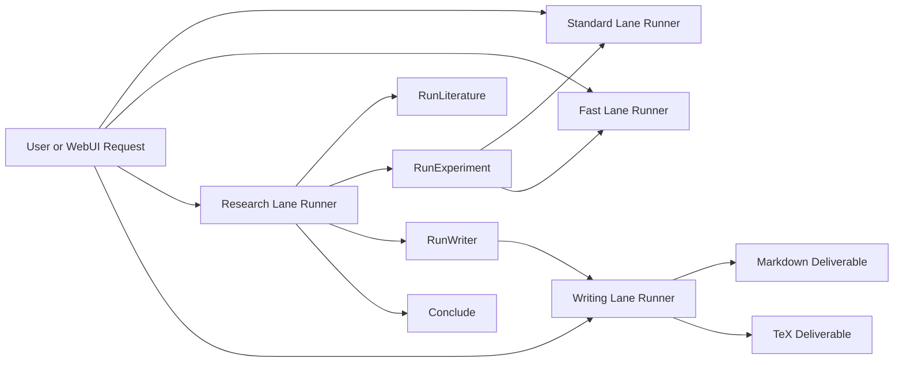
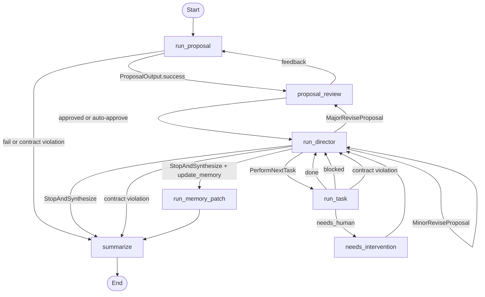
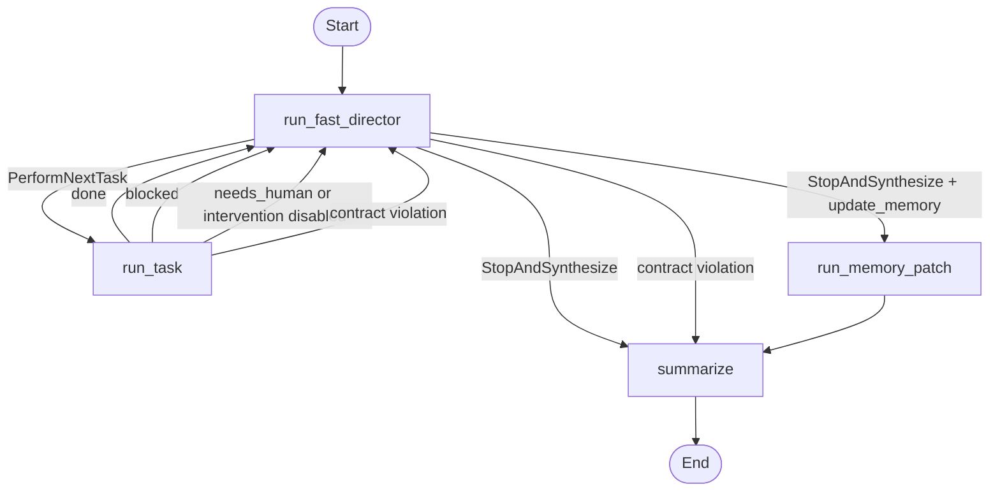
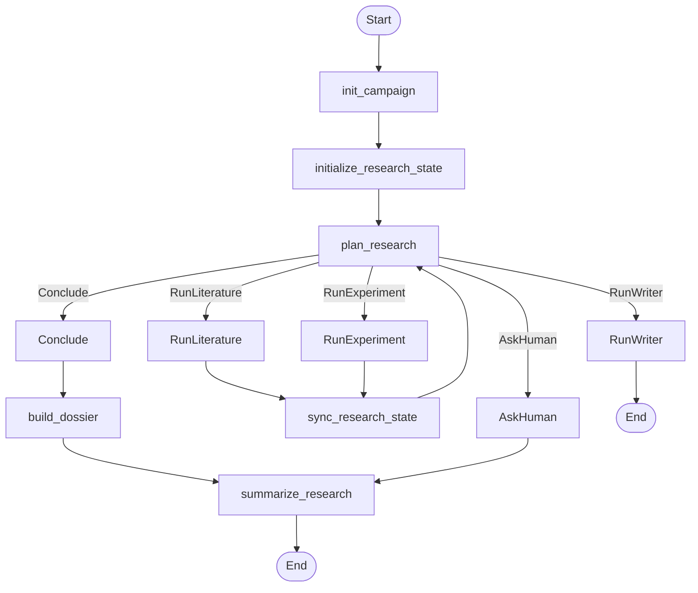
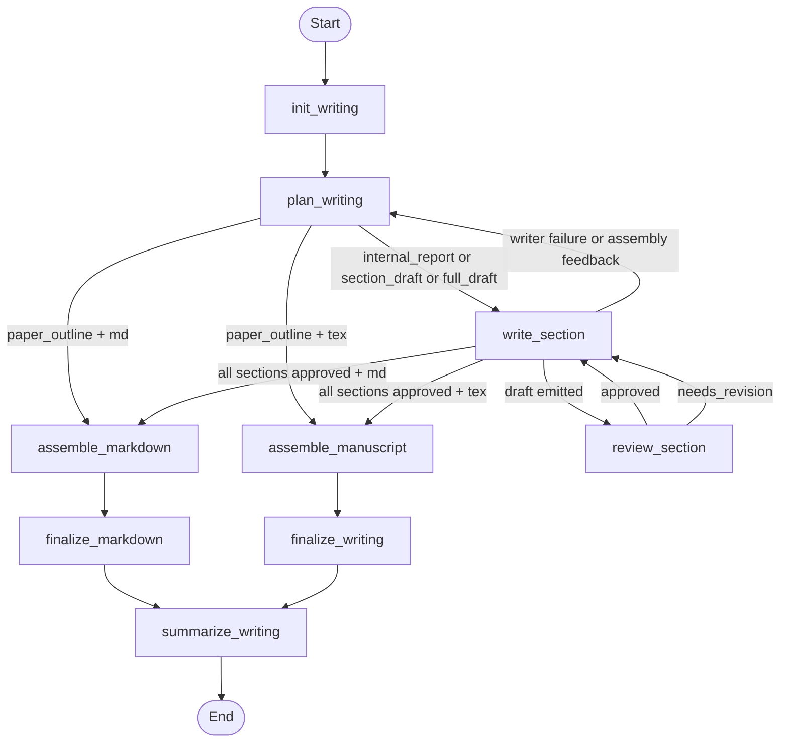

# Lane Graphs And Schemas

This note is the current map of CatMaster's lane structure, node transitions, and main schema contracts.

Source files:
- `catmaster/agents/graph.py`
- `catmaster/agents/nodes.py`
- `catmaster/agents/research_graph.py`
- `catmaster/agents/research_nodes.py`
- `catmaster/agents/research_schemas.py`
- `catmaster/agents/writing_graph.py`
- `catmaster/agents/writing_nodes.py`
- `catmaster/agents/writing_schemas.py`
- `catmaster/agents/response_schemas.py`
- `catmaster/runtime/writing/models.py`

## Top-Level Lane Map

Interpretation:
- `standard` and `fast` are execution lanes.
- `research` is an orchestration lane that can call literature, experiment, or writing work.
- `writing` is now an independent `md/tex` hard-routed lane.
- `research` no longer auto-launches writing after conclude. Only `RunWriter` starts writing.

## Standard Lane

Node roles:
- `run_proposal`: create initial proposal and work packages.
- `proposal_review`: human or auto review gate.
- `run_director`: choose next task, revise proposal, or stop.
- `run_task`: execute the current worker task.
- `needs_intervention`: explicit human intervention point.
- `run_memory_patch`: persist durable memory updates at stop time.
- `summarize`: produce final run summary without another LLM pass.

## Fast Lane

Differences vs standard:
- No proposal stage.
- No dedicated `proposal_review` node.
- No separate `needs_intervention` node in the graph.
- The loop is just `fast_director <-> run_task` until stop.

## Research Lane

Important behavior:
- `initialize_research_state` and `sync_research_state` both run the same state-sync logic with different reasons.
- `plan_research` emits a `ResearchLeadOutput` and directly chooses the next node.
- `RunExperiment` can internally call either the standard or fast execution lane through the experiment runner.
- `RunWriter` is terminal for the research graph and directly executes a real writing request.
- `Conclude` and `RunWriter` are now separate explicit decisions. There is no implicit post-graph writer launch.

## Writing Lane

Important behavior:
- `output_format=md` and `output_format=tex` are hard-routed from assembly onward.
- `md` path does not expose TeX compile tooling.
- `tex` path keeps manuscript assembly and compile/fix behavior.
- `paper_outline` can skip section drafting and go straight to assembly.

## Standard And Fast Schemas

### Request and Task Packet

#### `TaskPacket`

| Field | Meaning |
| --- | --- |
| `goal` | one-sentence worker goal |
| `task_detail` | execution detail, invariants, and done checks |
| `expected_outputs[]` | concrete deliverables or evidence strings |
| `suggested_tools[]` | advisory tool hints |
| `reference_hint[]` | short starting hints |

### Proposal Stage

#### `ProposalOutput`

| Field | Meaning |
| --- | --- |
| `status` | `success` or `fail` |
| `proposal_md` | full proposal markdown |
| `work_packages[]` | ordered milestone list |
| `error` | failure reason |
| `needs_human` | whether proposal failed due to missing human input |

### Director Stage

#### `DirectorOutput`

| Field | Meaning |
| --- | --- |
| `state` | `PerformNextTask`, `MinorReviseProposal`, `MajorReviseProposal`, `StopAndSynthesize` |
| `rationale` | short decision rationale |
| `perform_next_task.task_packet` | next task to execute |
| `minor_revise_proposal` | self-loop revision payload |
| `major_revise_proposal` | revision payload that returns to proposal review |
| `stop_and_synthesize.final_answer_md` | user-facing final answer |
| `update_memory[]` | durable memory updates, only valid on stop |

#### `FastDirectorOutput`

| Field | Meaning |
| --- | --- |
| `state` | `PerformNextTask` or `StopAndSynthesize` |
| `rationale` | short decision rationale |
| `perform_next_task.task_packet` | next task to execute |
| `stop_and_synthesize.final_answer_md` | user-facing final answer |
| `update_memory[]` | durable memory updates, only valid on stop |

### Execution Stage

#### `TaskOutput`

| Field | Meaning |
| --- | --- |
| `status` | `done` or `blocked` |
| `summary` | concise task outcome |
| `facts[]` | reusable verified facts |
| `files[]` | key artifact paths |
| `constraints[]` | new hard constraints |
| `open_questions[]` | unresolved blockers |
| `decisions[]` | downstream-impact decisions |
| `next_steps[]` | immediate actionable follow-ups |
| `artifacts[]` | extra artifact refs |
| `error` | failure reason for blocked tasks |
| `needs_human` | whether the task is blocked on human input |
| `hint` | recovery hint for blocked tasks |

#### `MemoryPatchOutput`

| Field | Meaning |
| --- | --- |
| `status` | `done` or `blocked` |
| `summary` | patch result summary |
| `applied_topics[]` | updated memory topic files |
| `error` | failure reason |
| `needs_human` | whether manual help is needed |

## Research Schemas

### Entry Request

#### `ResearchRequest`

| Field | Meaning |
| --- | --- |
| `question` | research question |
| `session_context_text` | chat/session context |
| `chat_session_id` | active chat session id |
| `entry_context_tokens_estimate` | estimated prompt-context size |
| `seed_hypotheses[]` | user-provided starting hypotheses |
| `exploration_policy` | `anchored`, `local_expand`, `open` |
| `max_cycles` | total research action budget |
| `max_literature_queries` | literature query budget |
| `max_fast_runs` | fast experiment budget |
| `max_standard_runs` | standard experiment budget |
| `writing_mode` | default writer mode only |
| `output_format` | default writer format only |
| `target_section` | default writer section focus |
| `allow_deep_report` | whether deep literature mode is allowed |
| `campaign_title` | optional title hint |

Note:
- `writing_mode/output_format/target_section` are defaults, not auto-trigger switches.
- Writing only starts if `ResearchLeadOutput.state == RunWriter`.

### Planner Decision

#### `ResearchLeadOutput`

| Field | Meaning |
| --- | --- |
| `state` | `RunLiterature`, `RunExperiment`, `RunWriter`, `AskHuman`, `Conclude` |
| `rationale` | short planner rationale |
| `run_literature` | literature action payload |
| `run_experiment` | experiment brief payload |
| `run_writer` | writer action payload |
| `ask_human` | human escalation payload |
| `conclude` | research conclusion payload |

#### `RunLiteraturePayload`

| Field | Meaning |
| --- | --- |
| `query` | literature query |
| `depth` | `none`, `quick`, `standard`, `focused`, `deep_report` |
| `topic` | optional topic label |
| `seed_papers[]` | anchor papers |
| `why_now` | why this query is the next action |

#### `ExperimentBrief`

Main inherited fields used by research lead:

| Field | Meaning |
| --- | --- |
| `title` | experiment title |
| `goal` | experiment goal |
| `task_detail` | execution details and invariants |
| `expected_outputs[]` | expected deliverables |
| `lane` | `fast` or `standard` |
| `hypothesis_ids[]` | linked hypotheses |

#### `RunWriterPayload`

This is intentionally shaped like a user-originated writing request.

| Field | Meaning |
| --- | --- |
| `request` | concrete writing instruction |
| `writing_mode` | `internal_report`, `paper_outline`, `section_draft`, `full_draft` |
| `output_format` | `md` or `tex` |
| `target_section` | optional section focus |

#### `AskHumanPayload`

| Field | Meaning |
| --- | --- |
| `questions[]` | concrete questions for the user |
| `blocking_reason` | why research cannot proceed |
| `context` | compact context for the user |

#### `ConcludePayload`

| Field | Meaning |
| --- | --- |
| `why_now` | why the campaign should conclude now |
| `recommended_next_steps[]` | suggested future work |
| `confidence` | `high`, `medium`, `low` |
| `memory_promotion_candidates[]` | memory updates to promote at conclusion |

### State Sync

#### `ResearchStateSyncOutput`

| Field | Meaning |
| --- | --- |
| `current_best_answer_md` | best current synthesis |
| `hypothesis_updates[]` | status changes on existing hypotheses |
| `new_hypotheses[]` | new hypothesis proposals |
| `supported_claims[]` | currently supported claims |
| `open_questions[]` | unresolved research questions |
| `evidence_links[]` | links from hypotheses to artifact refs |
| `board_notes` | compact board note |

## Writing Schemas

### Entry Request

#### `WritingRequest`

| Field | Meaning |
| --- | --- |
| `request` | direct writing instruction |
| `session_context_text` | chat/session context |
| `chat_session_id` | active chat session id |
| `entry_context_tokens_estimate` | estimated prompt-context size |
| `source_campaign_id` | research campaign source, if any |
| `writing_mode` | `internal_report`, `paper_outline`, `section_draft`, `full_draft` |
| `output_format` | `md` or `tex` |
| `target_section` | optional section target |

### Planning State

#### `WritingPlanOutput` / `WritingPlanModel`

| Field | Meaning |
| --- | --- |
| `title` | deliverable title |
| `writing_mode` | requested writing mode |
| `preferred_output_format` | `md` or `tex` |
| `target_audience` | intended reader |
| `abstract_md` | abstract in markdown |
| `outline_md` | outline text |
| `section_specs[]` | section plan |
| `figure_requests[]` | figure plan |
| `citation_needs[]` | citation checklist |
| `gaps[]` | unresolved writing gaps |

#### `WritingBoard`

| Field | Meaning |
| --- | --- |
| `run_id` | writing run id |
| `source_campaign_id` | linked research campaign id |
| `writing_mode` | current writing mode |
| `output_format` | `md` or `tex` |
| `status` | `planning`, `drafting`, `reviewing`, `finalizing`, `done`, `failed` |
| `title` | working title |
| `current_section_index` | next or current section index |
| `revision_counts` | per-section revision counters |
| `latest_manuscript_ref` | latest assembled output |
| `latest_bundle_ref` | latest bundle artifact |

### Drafting State

#### `SectionDraftOutput` / `SectionDraftModel`

| Field | Meaning |
| --- | --- |
| `section_id` | section key |
| `heading` | section heading |
| `status` | `drafted` or `revised` |
| `title` | optional section title |
| `section_md` | markdown section body |
| `section_tex` | TeX section body |
| `citations[]` | citation keys used |
| `artifact_refs[]` | supporting artifact refs |
| `planned_figure_ids[]` | figure ids intended by this section |
| `realized_figure_refs[]` | actual generated or reused figure refs |
| `figure_refs[]` | legacy combined figure refs |
| `latex_artifact_refs[]` | TeX-specific artifact refs |
| `claim_evidence_map[]` | claim-to-evidence map |
| `unresolved_gaps[]` | remaining writing gaps |

#### `SectionReviewOutput` / `SectionReviewModel`

| Field | Meaning |
| --- | --- |
| `section_id` | section key |
| `status` | `approved` or `needs_revision` |
| `revision_notes[]` | revision guidance |
| `unsupported_claims[]` | unsupported claims |
| `missing_citations[]` | citation problems |

### Finalization State

#### `ManuscriptBundleModel`

| Field | Meaning |
| --- | --- |
| `source_campaign_id` | linked campaign id |
| `writing_mode` | mode used to build the deliverable |
| `output_format` | `md` or `tex` |
| `title` | final title |
| `ordered_sections[]` | assembled section order |
| `bibliography_shortlist[]` | bibliography shortlist |
| `figure_manifest[]` | figure usage manifest |
| `final_manuscript_path` | final primary artifact path |
| `final_latex_path` | final TeX path when applicable |

#### `WritingFinalizeOutput`

| Field | Meaning |
| --- | --- |
| `summary` | finalization summary |
| `compile_notes[]` | compile or final-check notes |
| `final_output_path` | final output path for md or tex flows |
| `final_latex_path` | final TeX path when applicable |

## Places Still Worth Simplifying

1. Research lane currently has two terminal styles:
   `RunWriter -> end` and `Conclude -> build_dossier -> summarize_research`.
2. Writing lane already hard-splits `md/tex`, but TeX branch names still carry legacy wording such as `assemble_manuscript` and `finalize_writing`.
3. Standard and fast lanes share large parts of execution machinery even though their control graphs are simpler to think about than their implementation footprint suggests.
