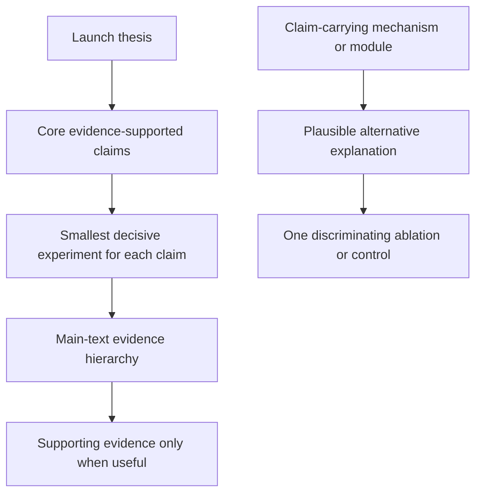
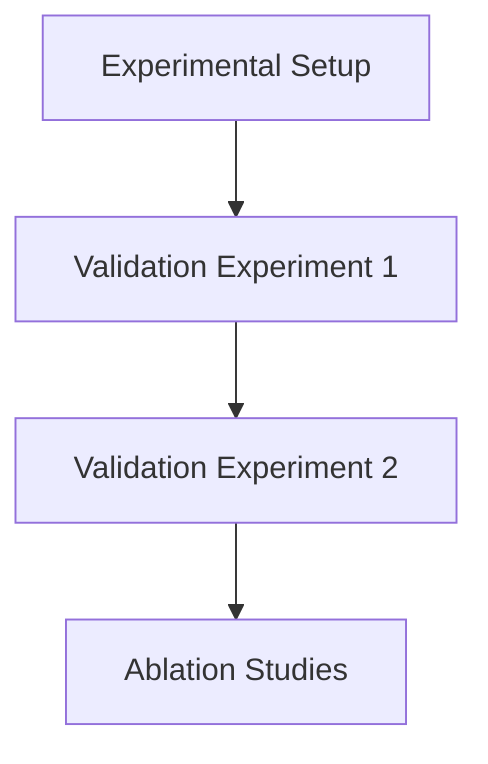

# Experiments Writing Guide

## Goal

Use the smallest convincing evidence package to establish the core method, the source of its advantage, and its value in the target setting.

## Three Core Questions

1. Does the core method solve the chosen problem under the condition the paper claims?
   - Use the baseline and metric that make that scientific question meaningful.
   - Keep the protocol fair and the comparison scope no broader than the claim.
2. What mechanism or design choice produces the advantage?
   - Use an ablation, perturbation, control, or mechanistic analysis only for components that carry a core contribution.
   - Show coupled-component interactions when they are necessary to explain the result.
3. Why does the advantage matter in the target setting?
   - Use the application, constraint, cost, efficiency, generalization, or scalability test that represents the intended value.
   - Add a stress test or alternative-explanation control only when it bears on the core claim.

## Experiment Planning

## Experiment Section Decomposition

## Figure/Table Writing Rules

`Good tables are part of experiment communication quality, not decoration.`

1. Figure captions and table captions are equally important in the writing quality of Experiments.

### Hard rules

1. Put caption above the table.
2. Avoid vertical lines (`|`) in tabular columns.
3. Do not use double rules or dense `\hline` stacks.
4. Use `booktabs` style (`\toprule`, `\midrule`, `\bottomrule`) for clean structure.
5. Use as few horizontal rules as possible; lines should separate groups, not every row.
6. Highlight key numbers (best/second-best or target rows) with subtle color emphasis.

### Readability rules from review practice

1. Label metric direction in column headers (for example `PSNR ↑`, `LPIPS ↓`).
2. Add units when needed so values are interpretable without guessing.
3. Align text columns left; keep numeric columns consistently aligned.
4. Keep numeric precision consistent (same decimal places within a metric column).
5. Group multi-dataset or multi-setting results using `\multicolumn` + `\cmidrule`, not vertical separators.
6. One table, one message: do not mix unrelated results in a single table.
7. If rows represent different attributes/ablations, encode that explicitly in row names or attribute columns.
8. Keep caption focused on setting/protocol/notation, not long discussion.
9. If there is little detail to explain, use one concise sentence to summarize the main result.
10. For single-column figures/tables in two-column papers, prefer placing them in the right column when layout allows, so readers can enter the page from the left-top text without breaking reading flow.

### Minimal LaTeX checklist

1. Add packages in preamble: `\usepackage{booktabs}`, `\usepackage{colortbl,xcolor}` (and optionally `\usepackage{siunitx}` for decimal alignment).
2. Replace `\hline`-heavy style with `\toprule/\midrule/\bottomrule`.
3. Put `\caption{...}` before `\label{...}` and keep caption above.
4. Use restrained highlighting; never color too many cells.

## Ablation selection

Use one integrated ablation display when it cleanly isolates the claim-carrying choices. Add a focused ablation or qualitative panel only when it explains a core mechanism or excludes a plausible alternative. Do not create an ablation inventory for every implementation detail.

## Experimental Rigor Checklist

1. Are the selected baselines relevant to the contest the paper actually enters?
2. Do the metrics represent the claimed value and remain scientifically fair?
3. Is each ablation or control tied to a core design or mechanism claim?
4. Are claims in the Abstract and Introduction supported by the displayed evidence?
5. Has irrelevant comparison breadth, defensive discussion, and operational detail been removed?
